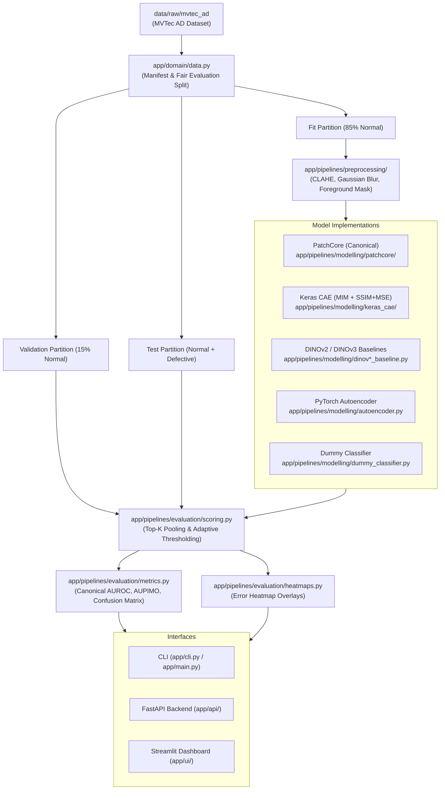

# System Architecture & Technical Design

## 1. High-Level Architecture Overview

The **Industrial Component Anomaly Detection** platform provides a modular, reproducible, and scientifically fair benchmarking system for visual defect detection on industrial components (such as the MVTec Anomaly Detection dataset).



---

## 2. Core Package Architecture

The codebase is organized into clear domain layers under `app/`:

### 2.1 Domain (`app/domain/`)

- **`data.py`**:
  - `build_mvtec_manifest(root)`: Traverses the dataset to construct a typed, immutable pandas manifest cataloging all image paths, products, defect types, labels, and ground-truth mask paths.
  - `build_fair_evaluation_split(manifest, category, seed=42)`: Enforces the deterministic `fair-eval-v1` split.
  - Partitions training normal images into strictly **85% fit** and **15% validation** subsets. Guarantees zero test-set leakage.

### 2.2 Preprocessing (`app/pipelines/preprocessing/`)

- **`base.py`**: Abstract `PreprocessingStep` interface and `PreprocessingPipeline` container.
- **`factory.py`**: Dynamic serialization and instantiation of preprocessing pipelines from JSON configurations.
- **`adapter.py`**: Bridges NumPy/OpenCV image arrays into PyTorch and Torchvision transform pipelines.
- **`steps/`**: Modular, isolated transforms:
  - `clahe.py`: Contrast-Limited Adaptive Histogram Equalization.
  - `gaussian_blur.py`: High-frequency noise suppression filter.
  - `foreground_mask.py`: Otsu thresholding with Canny edge detection for background suppression.
- **`augmentation.py`**: Domain-specific data augmentations applied strictly during training.

### 2.3 Modelling (`app/pipelines/modelling/`)

- **`patchcore/`**:
  - Primary implementation of the PatchCore algorithm using frozen ImageNet backbones (e.g. ResNet-18, WideResNet-50-2).
  - Feature extraction across intermediate layers (`layer2`, `layer3`).
  - Coreset subsampling via greedy k-Center selection.
  - Raw score space scaling with deterministic disk caching and soft-delete `.trash/` recovery.
- **`keras_cae/`**:
  - Convolutional Autoencoder with Masked Image Modeling (MIM), combined SSIM+MSE loss, and AdamW optimization.
  - Top-K spatial pooling for image-level classification.
  - Automated disk caching and hyperparameter study scripts (`optuna_study.py`).
- **`dinov2_baseline.py` & `dinov3_baseline.py`**:
  - Zero-shot / frozen vision foundation model patch nearest-neighbor baseline with position/density-aware scoring.
- **`autoencoder.py`**:
  - Classical PyTorch convolutional autoencoder baseline.
- **`dummy_classifier.py`**:
  - Empirical and theoretical demonstrations of the accuracy paradox on imbalanced anomaly data.

### 2.4 Evaluation (`app/pipelines/evaluation/`)

- **`metrics.py`**:
  - Canonical implementation of `compute_image_auroc` and `compute_aupimo`.
  - Canonical $256 \times 256$ resolution enforcement for anomaly score maps and ground-truth binary masks.
  - Strict AUPIMO integration over $\text{FPR} \in [10^{-5}, 10^{-4}]$ with $50,000$ thresholds using `anomalib.metrics.AUPIMO`.
  - Full confusion matrix calculation (True Positives, False Positives, False Negatives, True Negatives) and anomalous-class F1 score.
- **`scoring.py`**:
  - Top-K spatial pooling and adaptive threshold estimation (quantile and Mahalanobis methods) calibrated exclusively on normal validation data.
- **`heatmaps.py`**:
  - Production of explainability overlays blending original input images with colorized anomaly heatmaps.
- **`visualization.py`**:
  - Matplotlib trade-off curves, Precision-Recall curves, and interactive figure rendering.

### 2.5 API Backend (`app/api/`)

- **`main.py`**:
  - Application factory (`create_app()`) mounting CORS middleware and registering domain routers.
  - Backward-compatible route handlers and test hooks.
- **`routers/`**:
  - `dummy.py`: `/api/dummy`, `/api/pipelines/dummy`.
  - `patchcore.py`: `/api/patchcore`, `/api/pipelines/patchcore`.
  - `keras_cae.py`: `/api/keras_cae`, `/api/pipelines/keras_cae`, `/api/pipelines/cae`.
  - `autoencoder.py`: `/api/autoencoder`, `/api/pipelines/autoencoder`.
  - `dino.py`: `/api/dinov2`, `/api/pipelines/dinov2`, `/api/dinov3`, `/api/pipelines/dinov3`.

### 2.6 User Interface (`app/ui/`)

- **`main.py`**:
  - Modular Streamlit dashboard exposing the complete evaluation guide, model training, cached registries, and visualization tabs.
- **`components/`**:
  - `api_client.py`: Robust HTTP communication with FastAPI backend.
  - `metrics.py`: Standardized metric cards and experiment summary cards.
  - `heatmaps.py`: Grid explorer for anomalous predictions and ground-truth overlays.
- **`tabs/`**:
  - `guide_tab.py`: Beginner-friendly interpretation guide covering the accuracy paradox, AUROC, and AUPIMO.
  - `dummy_tab.py`: Synthetic and real data dummy classifier evaluation.
  - `autoencoder_tab.py`: PyTorch autoencoder training and evaluation.
  - `patchcore_tab.py`: Interactive PatchCore registry, training, and cache management.
  - `keras_cae_tab.py`: State-of-the-art Keras CAE runner, loss curves, and explainability heatmaps.
  - `dino_tab.py`: DINOv2 and DINOv3 foundation model nearest-neighbor benchmarking.

---

## 3. Fair & Scientifically Sound Model Evaluation Protocol

All models in this repository strictly adhere to the `fair-eval-v1` protocol defined in `.agents/rules/01-fair-scientific-evaluation.md`:

1. **Deterministic Data Partitioning (`seed=42`)**:
   - Models are fit strictly on the **85% fit partition** of normal training samples.
   - Decision thresholds are calibrated strictly on the **15% validation partition** of normal samples.
   - Test data remains unseen until final scoring.
2. **Canonical $256 \times 256$ Evaluation Resolution**:
   - Anomaly score heatmaps are resized via bilinear interpolation to $256 \times 256$.
   - Ground-truth binary masks are resized via nearest-neighbor interpolation to $256 \times 256$ and binarized ($> 0.5$).
3. **Strict AUPIMO**:
   - Computed via `anomalib.metrics.AUPIMO` over False Positive Rate bounds $\text{FPR} \in [10^{-5}, 10^{-4}]$ with $50,000$ thresholds.
   - Never replaced by ad-hoc pooled-pixel substitutes or silent fallbacks.
4. **Comprehensive Confusion Matrix**:
   - Persists TP, FP, FN, TN, precision, recall, and anomalous-class F1 score alongside AUROC and AUPIMO.
5. **Protocol Cache Versioning**:
   - Model disk cache keys incorporate the `fair-eval-v1` identity, dataset split evidence hash, canonical map dimensions, and threshold count to prevent stale evaluation loading.

---

## 4. Developer Workflows & Commands

Standard developer commands via `just` and `pixi`:

```bash
# Run pytest test suite
just test

# Format and lint codebase
just lint

# Run all pre-commit quality gates
just check

# Run PatchCore pipeline via CLI
just run-patchcore category="bottle"

# Run Keras CAE pipeline via CLI
just run-cae category="bottle" epochs=20

# Run evaluation orchestrator
just evaluate patchcore
just evaluate keras --tuned

# Launch FastAPI and Streamlit concurrently
just run
```
