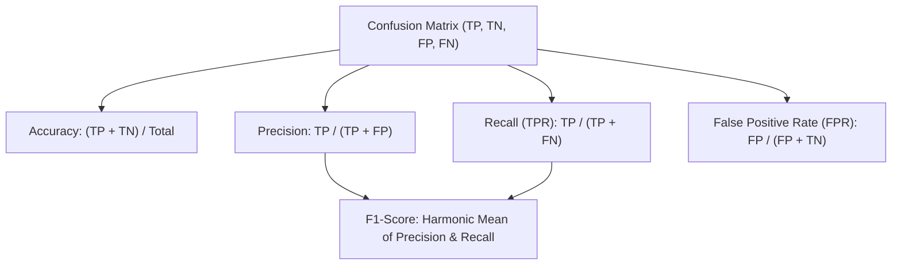
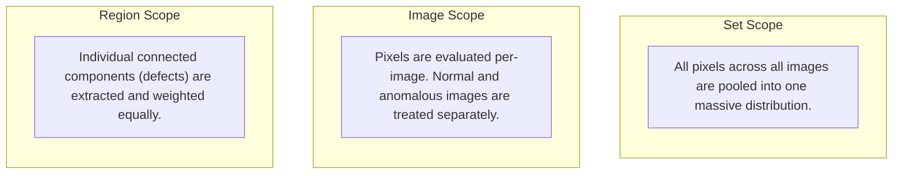

# Anomaly Detection Metrics: The Theory Behind AUPIMO, AUROC, and AUPRO

This document provides a rigorous, detail-oriented review of visual anomaly detection (AD) evaluation metrics. It contrasts classical pixel-classification approaches with state-of-the-art per-image/normal-only validation frameworks, as introduced by Joao P. C. Bertoldo, Dick Ameln, Ashwin Vaidya, and Samet Akçay in their seminal paper:

> **AUPIMO: Redefining Anomaly Localization Benchmarks with High Speed and Low Tolerance**

---

## 1. Foundational Data Science Concepts & The Confusion Matrix

To understand complex anomaly localization metrics, we must ground them in standard binary classification theory. In anomaly segmentation, we treat **each individual pixel** as a binary classification instance.

### The Confusion Matrix at the Pixel Level

For any pixel, let the ground-truth label be $y \in \{0, 1\}$ (where $0$ represents "normal" and $1$ represents "anomalous") and the model's binarized prediction be $\hat{y} \in \{0, 1\}$ (obtained by thresholding the anomaly score $a$ at a threshold $t$, i.e., $\hat{y} = \mathbb{I}(a \ge t)$).

| Ground Truth \ Prediction | Predicted Normal ($\hat{y} = 0$) | Predicted Anomalous ($\hat{y} = 1$) |
| :--- | :--- | :--- |
| **Actual Normal ($y = 0$)** | **True Negative (TN)**<br>Normal pixel correctly left unflagged. | **False Positive (FP)**<br>Normal pixel incorrectly flagged as anomalous (Type I Error / False Alarm). |
| **Actual Anomalous ($y = 1$)** | **False Negative (FN)**<br>Anomalous pixel missed by the model (Type II Error / Missed Defect). | **True Positive (TP)**<br>Anomalous pixel correctly flagged. |

### Core Performance Metrics

Based on the counts of TP, TN, FP, and FN across the evaluation domain, we define the following rates and scores:



#### 1. Recall / True Positive Rate (TPR) / Sensitivity
Recall measures the model's ability to locate and detect all anomalous pixels.
$$Recall = TPR = \frac{TP}{TP + FN}$$
*   **Interpretation in AD:** "What percentage of the actual defect area did the model successfully segment?"
*   **Limitation:** A model that marks the entire image as anomalous achieves $100\%$ Recall, but is practically useless.

#### 2. Precision
Precision measures the trustworthiness of the model's positive predictions.
$$Precision = \frac{TP}{TP + FP}$$
*   **Interpretation in AD:** "Of all the pixels flagged as anomalous, what percentage actually belonged to a defect?"
*   **Limitation:** If a model only flags a single, highly obvious pixel as anomalous and gets it right, Precision is $100\%$, even if it missed a massive surrounding defect.

#### 3. False Positive Rate (FPR) / Fall-Out
FPR measures the rate of false alarms on normal pixels.
$$FPR = \frac{FP}{FP + TN}$$
*   **Interpretation in AD:** "What percentage of the healthy/normal region was incorrectly flagged as defective?"
*   **Crucial Role in Industry:** In high-throughput industrial manufacturing, a low FPR is paramount. If a model has a $1\%$ pixel-level FPR, it might trigger false alarms on almost every normal image, causing costly line stoppages.

#### 4. Accuracy
Accuracy is the overall ratio of correct predictions.
$$Accuracy = \frac{TP + TN}{TP + TN + FP + FN}$$
*   **The Class Imbalance Failure Mode:** In typical AD datasets (e.g., MVTec AD), normal pixels make up $>99\%$ of the dataset. A trivial model that predicts *every single pixel* is normal achieves $>99\%$ accuracy while failing completely to locate any defects. Thus, **Accuracy is never used for evaluating anomaly localization.**

#### 5. F1-Score
The F1-score is the harmonic mean of Precision and Recall, providing a balanced metric when class distribution is highly imbalanced.
$$F_1 = 2 \cdot \frac{Precision \cdot Recall}{Precision + Recall} = \frac{2 \cdot TP}{2 \cdot TP + FP + FN}$$

---

## 2. Scoping and Notation in Anomaly Localization

Evaluating anomaly detection models requires assessing anomaly scores at different levels of granularity. Let:
*   $\mathcal{Y}$: The set of all images in the dataset.
*   $\mathcal{Y}^0 \subset \mathcal{Y}$: The subset of strictly normal images (no anomalies present).
*   $\mathcal{Y}^1 \subset \mathcal{Y}$: The subset of anomalous images.
*   $a \in \mathbb{R}_+^M$: The continuous anomaly score map computed for a given image, containing $M$ pixels.
*   $y \in \{0, 1\}^M$: The binary ground-truth mask for that image.
*   $r \subset \{1, \dots, M\}$: A region mask, representing a single maximally connected component of anomalous pixels (i.e., a distinct physical defect).
*   $\mathcal{R}$: The set of all anomalous regions across all anomalous images in the dataset.
*   $t \in \mathbb{R}$: A binarization threshold.



---

## 3. Mathematical Precursors: AUROC and AUPRO

### 3.1 AUROC (Area Under the Receiver Operating Characteristic)

The classic pixel-level AUROC treats the entire test dataset as a single pool of pixels, ignoring which pixel belongs to which image.

*   **Set False Positive Rate ($F_s(t)$):**
    $$F_s(t) = \frac{\sum_{y \in \mathcal{Y}} |(a \ge t) \wedge (\neg y)|}{\sum_{y \in \mathcal{Y}} |\neg y|}$$
    *Denominator: The total count of normal pixels across the entire dataset.*
    *Numerator: The total count of normal pixels incorrectly predicted as anomalous at threshold $t$.*

*   **Set True Positive Rate ($T_s(t)$):**
    $$T_s(t) = \frac{\sum_{y \in \mathcal{Y}} |(a \ge t) \wedge y|}{\sum_{y \in \mathcal{Y}} |y|}$$
    *Denominator: The total count of anomalous pixels across the entire dataset.*
    *Numerator: The total count of anomalous pixels correctly predicted as anomalous at threshold $t$.*

*   **AUROC Integral:**
    $$AUROC = \int_0^1 T_s(F_s^{-1}(z)) \, dz$$
    *Where $F_s^{-1}(z)$ maps a target Set FPR $z$ to the corresponding binarization threshold $t$.*

#### Fundamental Flaws of AUROC:
1.  **Pixel-Weighting Bias:** Because all pixels are pooled, a single large defect (e.g., a massive scratch covering $10,000$ pixels) contributes as much to the metric as $100$ small defects of $100$ pixels each.
2.  **FPR Dilution:** The massive number of normal pixels in the test set dominates the denominator of $F_s(t)$, hiding significant false-positive clusters on individual images.

---

### 3.2 AUPRO (Area Under the Per-Region Overlap)

AUPRO addresses AUROC's bias toward large defects by treating each connected anomalous region $r \in \mathcal{R}$ as an independent entity.

*   **Region TPR ($T_r(t)$):**
    $$T_r(t) = \frac{|(a \ge t) \wedge r|}{|r|}$$
    *The fraction of pixels in region $r$ that are correctly predicted as anomalous at threshold $t$.*

*   **Average Region TPR ($\overline{T_r}(t)$):**
    $$\overline{T_r}(t) = \frac{1}{|\mathcal{R}|} \sum_{r \in \mathcal{R}} T_r(t)$$
    *The arithmetic mean of recall across all physical defects in the dataset, giving equal weight to small and large anomalies.*

*   **AUPRO Integral:**
    $$AUPRO = \frac{1}{U} \int_0^U \overline{T_r}(F_s^{-1}(z)) \, dz$$
    *Typically, $U = 0.3$ (integrating only up to a $30\%$ Set FPR limit).*

#### Fundamental Flaws of AUPRO:
1.  **Target Bias (Anomalous-Image Leakage):** The threshold mapping $F_s^{-1}(z)$ uses the Set FPR ($F_s$), which is computed using normal pixels from *both* normal and anomalous images. This violates unsupervised validation principles: the threshold calibration depends on the specific layout and background variance of the anomalous test images.
2.  **Computational Complexity:** Finding connected components (regions) requires running segmentation algorithms (like flood fill or union-find) on ground-truth masks. This is highly serial and computationally expensive, making GPU acceleration difficult.
3.  **Noisy Annotation Sensitivity:** If a ground truth mask contains a tiny 1-pixel annotation error, AUPRO treats this 1-pixel component as an entire region, giving it the same weight as a major physical defect.

---

## 4. The New Standard: AUPIMO (Area Under the Per-Image Overlap)

AUPIMO resolves the core limitations of both AUROC and AUPRO by introducing **Normal-only validation** (removing target bias) and **Per-image scoring** (enhancing statistical power and computation speed).

```
         Traditional Pipeline (AUROC/AUPRO)
         ┌────────────────────────────────────────────────────────┐
         │ Global Thresholds Calibration (Depends on Test Set)     │ ──> Bias Leakage
         └────────────────────────────────────────────────────────┘
                                     │
         AUPIMO Pipeline (Normal-only Validation)
         ┌────────────────────────────────────────────────────────┐
         │ Thresholds calibrated SOLELY on Normal Images (Y0)     │ ──> Unsupervised Clean
         └────────────────────────────────────────────────────────┘
                                     │
                                     ▼
                      ┌──────────────────────────────┐
                      │    Per-Image TPR Curves      │
                      └──────────────────────────────┘
                                     │
                                     ▼
                      ┌──────────────────────────────┐
                      │      AUPIMO Integration      │
                      │  (Bounded Strict Tolerance)  │
                      └──────────────────────────────┘
```

### 4.1 Mathematical Formulation

#### 1. Shared FPR ($F_{sh}(t)$)
The Shared FPR is calibrated **strictly** using normal images ($\mathcal{Y}^0$), ensuring the threshold selection is completely blind to anomalous patterns:
$$F_{sh}(t) = \frac{1}{|\mathcal{Y}^0|} \sum_{y \in \mathcal{Y}^0} F_i^y(t)$$
*Where $F_i^y(t)$ is the image-scoped false positive rate for a normal image $y \in \mathcal{Y}^0$:*
$$F_i^y(t) = \frac{|(a \ge t) \wedge (\neg y)|}{|\neg y|} = \frac{|a \ge t|}{M}$$

#### 2. Image TPR ($T_i(t)$)
For an anomalous image $y \in \mathcal{Y}^1$, the True Positive Rate is calculated strictly within that image:
$$T_i(t) = \frac{|(a \ge t) \wedge y|}{|y|}$$

#### 3. The PIMO Curve
For each individual anomalous image $y \in \mathcal{Y}^1$, we map the Shared FPR to the Image TPR across thresholds, plotting it on a logarithmic scale:
$$PIMO_y : z \mapsto T_i(F_{sh}^{-1}(z))$$
where $z \in [L, U]$ is the Shared FPR.

#### 4. The AUPIMO Integral
The final score for an individual anomalous image is the normalized area under this PIMO curve in the log-FPR domain:
$$AUPIMO = \int_{\log(L)}^{\log(U)} \frac{T_i(F_{sh}^{-1}(z))}{\log(U/L)} \, d\log(z)$$
Which can be written with respect to the Shared FPR variable $z$ as:
$$AUPIMO = \frac{1}{\ln(U) - \ln(L)} \int_{L}^{U} \frac{T_i(F_{sh}^{-1}(z))}{z} \, dz$$

### 4.2 Integration Bounds: "Low Tolerance"

AUPIMO is evaluated using highly conservative bounds for the Shared FPR:
$$L = 10^{-5} \quad \text{and} \quad U = 10^{-4}$$

*   **Physical Meaning:** At these thresholds, a model is allowed to flag almost zero false positive pixels on normal images (for a $256 \times 256$ image, $10^{-5}$ represents less than $1$ pixel, and $10^{-4}$ represents at most $6.5$ pixels).
*   **The Practical Meaning:** An AUPIMO score represents: *"How well does the model locate the defect in this image when constrained to a threshold that guarantees virtually zero false alarms on clean production items?"*

---

## 5. Comparative Metric Matrix

| Characteristic | AUROC (Pixel-level) | AUPRO | AUPIMO |
| :--- | :--- | :--- | :--- |
| **Validation Scope** | Set-wide | Set-wide | Per-Image |
| **Threshold Calibration Source** | Full test set (Normal + Anomalous) | Full test set (Normal + Anomalous) | **Strictly Normal Images Only ($\mathcal{Y}^0$)** |
| **Bias Status** | Biased (Target Leakage) | Biased (Target Leakage) | **Unbiased (Clean Unsupervised)** |
| **Connected Components?** | No | Yes (Required) | **No (Fast Pixel Ratios)** |
| **Computation Speed** | Moderate | Slow (CPU-bottlenecked) | **Extremely Fast (GPU-friendly)** |
| **Sensitivity to Size** | High (Big defects dominate) | None (Weighted per region) | Low (Weighted per image) |
| **Noise Resilience** | High | Low (Tiny annotation errors act as full regions) | **High (Pixel-ratio averaging)** |
| **Granularity of Output** | Single scalar for entire dataset | Single scalar for entire dataset | **Distribution of scores (one per image)** |

---

## 6. Experimental Insights & "The Unsolved Benchmark"

By re-evaluating established state-of-the-art architectures (e.g., PatchCore, EfficientAD, PaDiM, SimpleNet, FastFlow) using AUPIMO, the authors revealed several critical industrial insights:

1.  **Public Benchmarks are NOT Solved:** Under AUROC and AUPRO, models score $98\% - 99\%$. Under the strict low-tolerance constraints of AUPIMO, average performance falls to $60\% - 70\%$, indicating that models struggle to maintain high recall while avoiding false alarms.
2.  **High Metric Variance:** Models exhibit extremely high performance variance across test images, scoring near $100\%$ on some, and $0\%$ on others.
3.  **The $P_{33}$ Metric:** To measure worst-case, reliable performance, the authors propose looking at the **33rd percentile ($P_{33}$)** of the AUPIMO distribution. A high $P_{33}$ guarantees that the model works reliably across at least two-thirds of the anomalous cases.
4.  **No Universal Architecture:** No single model dominates. PatchCore performs poorly on texture anomalies with complex repetitions (like VisA's "Macaroni 2"), while structural models like EfficientAD handle them easily. A context-dependent model selection process remains necessary.

---

## 7. Mathematical and Practical Limitations of AUPIMO

Despite its advantages, practitioners must be aware of AUPIMO's limitations:

1.  **No Precision Evaluation (Recall-Only):** AUPIMO measures segmentation recall ($T_i$) under a low false-positive constraint on normal images. However, it does not penalize over-segmentation (low precision) *inside* the anomalous image itself. If a model detects a 2-pixel scratch but segments a massive 500-pixel blob around it, the AUPIMO score is unaffected (provided the model remains quiet on clean images).
2.  **Multiple Anomalies Masking Effect:** Because recall is averaged at the image scope ($T_i$) rather than the region scope, an image with two separate defects where one is fully detected and the other is fully missed yields a score of $\approx 50\%$. This masks the fact that a distinct anomaly was completely missed.
3.  **Resolution Dependency:** The default bounds ($10^{-5}$ to $10^{-4}$) assume high-resolution imagery. On a $64 \times 64$ image (total $4096$ pixels), the lower bound $10^{-5}$ represents $0.04$ pixels, which is mathematically impossible to evaluate, rendering the default bounds meaningless for low-resolution inputs.
