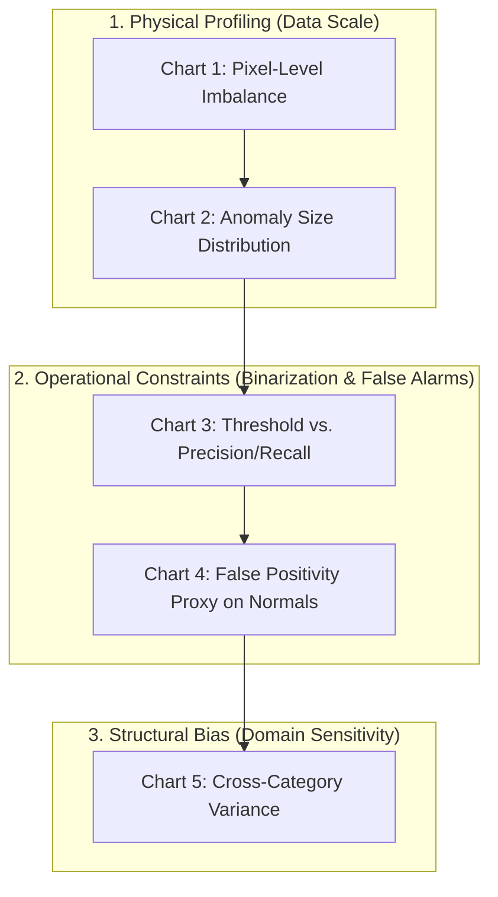

# Exploratory Data Analysis (EDA) & Evaluation Plan

This document outlines the strategic plan for **Step 1: Data Exploration** of the industrial anomaly detection pipeline. It defines a 5-chart visualization framework designed to capture both the physical properties of the dataset and the mathematical boundaries of the anomaly detection task.

---

## 1. Rationale: Analyzing the Dataset's Structure and Metadata

The MVTec AD dataset is structured specifically for unsupervised, high-resolution anomaly detection. Exploring its characteristics requires looking beyond standard image-level statistics because:

* In traditional computer vision projects, Exploratory Data Analysis (EDA) is often limited to descriptive image-level statistics (e.g., class ratios, lighting histograms, and spatial distributions of annotations). While valuable, this surface-level analysis fails to capture the true complexity of visual anomaly detection (AD) on the MVTec AD dataset.
* In industrial visual inspection, the core challenge is **high-precision spatial localization** under **extreme class imbalances** (where anomalous pixels represent less than 3% of the testing data). To highlight the dataset's true structure, limitations, and inherent biases on day one, we must execute a Meta-Exploratory Data Analysis.
* By leveraging the pre-computed benchmark metrics and curves packaged in the [jpcbertoldo/aupimo](https://github.com/jpcbertoldo/aupimo) ecosystem, we can analyze the performance envelopes of 8 state-of-the-art architectures without training a single model from scratch. This approach allows us to map the mathematical boundary lines of the dataset immediately, translating raw data structures into concrete business constraints.

### Leveraging Included Baseline Annotations

The dataset is packaged with both binary ground-truth masks and a rich set of pre-computed baseline anomaly maps from established architectures (such as PatchCore, Student-Teacher, and Autoencoders). These annotations and pre-computed predictions represent a significant part of the dataset's footprint. We can ingest and explore these outputs directly during the initial phase to map model performance boundaries before training.

### Characterizing Complex Physical and Structural Variances

The dataset spans 15 categories divided into textures and structured objects, each featuring different types of defects (cracks, scratches, contamination). Analyzing how baseline anomaly maps react to normal validation images (where any detection is a false alarm) and anomalous test images reveals the structural differences and binarization thresholds inherent in each category's layout.

### Core Arguments for Benchmarking as Part of the *EDA & Evaluation Plan*

#### A. Zero-Training Feasibility

We do not need to spend days setting up GPU environments, managing CUDA dependencies, or running long training loops to evaluate model behaviors. The benchmark ecosystem provides highly structured, pre-calculated evaluation files for major architectures (such as PatchCore, EfficientAD, FastFlow, PaDiM, PyramidFlow, RevDist++, SimpleNet, and U-Flow):

* **Precision-Recall Curve Data (`aupr.json`)**: Contains coordinated arrays of thresholds, precision values, and recall values.
* **ROC and Per-Region Overlap Data (`auroc.json`, `aupro.json`)**: Stores dataset-wide evaluation trajectories.
* **Granular Per-Image Scores (`aupimos.json`)**: Stores individual, image-level AUPIMO metrics for every single anomalous image in the test set.

Using standard parsing libraries, we can read these JSONs directly and plot the dataset's response behavior.

#### B. Defining the Operational Envelope (Thresholds vs. Financial Trade-offs)

An anomaly map outputs continuous values between $0.0$ and $1.0$. In a real factory, we must select a binary cutoff threshold $t$ to accept or reject a part. Plotting the thresholds of baseline models against precision and recall (using `aupr.json`) lets us visualize the "breakpoint phenomenon."

This allows us to demonstrate to stakeholders:

* How violently the system's sensitivity reacts to small threshold adjustments.
* The exact numerical trade-off between stopping the assembly line for false alarms (Precision drop) versus shipping defective parts to customers (Recall drop).

#### C. Quantifying False Alarms via Shared FPR ($F_{sh}$)

By evaluating baseline models strictly on the defect-free validation images, we can chart the Shared False Positive Rate ($F_{sh}$) across different thresholds. Since these images have no defects, every single flagged pixel represents a false positive.

Exploring this behavior allows us to calculate a proxy for "Wasted Human Hours" (alert fatigue) under strict tolerances ($10^{-5}$ to $10^{-4}$ FPR) before we write any custom model code.

#### D. Mapping Cross-Category Biases (The 15 Sub-Datasets)

MVTec AD is not a single dataset; it is an aggregate of 15 unique manufacturing challenges (5 repetitive/structural textures like wood/grid, and 10 spatial objects like transistors/screws).

Using the granular image-level arrays in `aupimos.json`, we can plot a cross-category performance distribution (using boxplots or violin plots). This mathematically demonstrates:

* Which categories are virtually "solved" (highly rigid, aligned items).
* Which categories exhibit extreme performance drops and high variance (highly deformable or organic textures like leather).
* Why a single unified model cannot generalize across all category structures on the factory floor, justifying domain-specific configurations.

---

## 2. The 5-Chart Visualization Plan: "Funnel of Discovery"

**The proposed deliverables** are structured as a **Funnel of Discovery**:

* **Charts 1 & 2** explore the physical properties of the data (imbalance and scale).
* **Charts 3 & 4** map the mathematical constraints of operational deployment (thresholding and false alarm rates).
* **Chart 5** exposes the dataset's structural biases (performance variation across manufacturing domains).



---

### Chart 1: Pixel-Level Class Imbalance (Log-Scale Bar Chart)

* **The Concept:** A bar chart comparing the total count of normal pixels to the extremely small pool of anomalous pixels across all MVTec AD categories.
* **Why it's Crucial (Dataset Structure):** Industrial anomaly detection is fundamentally asymmetric. This chart visually demonstrates the extreme sparsity of the target class (the "needle in a haystack" problem).
* **Business Perspective:** This chart justifies why standard metrics like **Accuracy** are deceptive. For instance, in a production line yielding $99.9\%$ defect-free parts, a broken model that predicts "Normal" for every pixel achieves $99.9\%$ accuracy while failing to detect any defects. This chart explains to business stakeholders why we must adopt precision, recall, and AUPIMO.
* **Statistical Validation:** Computes the exact ratio of normal to anomalous pixels per category. We validate the variance of this imbalance using a **Chi-Square Goodness-of-Fit Test** to statistically prove that defects are not uniformly distributed across different categories (e.g., confirming that metallic scratches occupy significantly different pixel areas than fabric tears).

### Chart 2: Anomaly Size Distribution (Boxplot)

* **The Concept:** A boxplot mapping the area of ground-truth defect regions relative to the total image size (ranging from $10^{-1}$ down to $10^{-4}$ of the overall resolution).
* **Why it's Crucial (Dataset Challenge):** Exposes the physical variance in defect dimensions. It informs our model selection regarding receptive fields: an architecture configured to detect large missing parts (macro-features) might overlook microscopic structural cracks (micro-features).
* **Business Perspective:** Sets hardware and camera requirements. If defects represent only $10^{-4}$ of the frame, high-resolution cameras and precise lighting are necessary. Aggressive downsampling of images to save computing power will destroy critical defects before the model can process them.
* **Statistical Validation:** Calculates the Interquartile Range (IQR) of defect sizes. We perform a **Kruskal-Wallis H-test** (a non-parametric alternative to ANOVA) to statistically prove that the median defect size differs significantly between different object categories (e.g., proving that "cable" defects are statistically smaller than "leather" defects).

### Chart 3: Threshold vs. Precision/Recall (Line Graph)

* **The Concept:** A line plot showing the continuous binarization threshold on the x-axis against Precision and Recall on the y-axis, highlighting the "breakpoint phenomenon" where performance drops sharply.
* **Why it's Crucial (Dataset Challenge):** Visualizes the sensitivity of binarized decisions. Since models output a continuous anomaly score map, setting a hard decision threshold is required to flag a part. This chart shows how minor changes in the threshold affect precision and recall.
* **Business Perspective:** Illustrates the direct trade-off between throughput and quality. A high-recall threshold catches every defect but stops the line for false alarms, reducing throughput. A high-precision threshold prevents false line stoppages but increases the risk of shipping defective parts. This graph allows business leaders to select a risk profile visually.
* **Extraction Method:** Rely on the pre-computed benchmark results in the `jpcbertoldo/aupimo` repository under the `data/experiments/benchmark/` directory (organized by model, dataset, and category). For example, locate:

    ```path
    data/experiments/benchmark/patchcore_wr50/mvtec/bottle/aupr.json
    ```

    Parse the JSON file to extract the synchronized arrays for `thresholds`, `precisions`, and `recalls`.

* **Execution:** Plot `thresholds` on the X-axis and plot both `precisions` and `recalls` arrays on the Y-axis.
* **Statistical Validation:** Validates the threshold selection by computing the **Maximum $F_{\beta}$ Score**. Depending on the business cost of a missed defect versus a false alarm, we can optimize for $F_2$ (weighing recall higher) or $F_{0.5}$ (weighing precision higher).

### Chart 4: False Positivity Proxy on Normal Data (Scatter/Histogram)

* **The Concept:** A scatter plot or histogram measuring the distribution of false detections strictly on validation images that contain zero anomalies.
* **Why it's Crucial (Dataset Challenge):** Directly evaluates the constraints of the AUPIMO evaluation range ($10^{-5}$ to $10^{-4}$ FPR). It measures how clean the model remains under natural, non-malicious variations like dust, sensor noise, or minor lighting changes.
* **Business Perspective:** Translates abstract statistics into operational costs (e.g., "Wasted Human Hours"). If a model triggers multiple false alarms per clean product, operators face alert fatigue and manual reinspection overhead. This chart determines whether a model is deployable on the factory floor.
* **Extraction Method:** Rather than manually counting disconnected blobs, utilize the Shared False Positive Rate ($F_{sh}$) calculated exclusively on normal images, which is stored in the benchmark curves. Run the provided Python scripts (such as `src/aupimo/pimo.py` or inspect the generated PIMO curves) to map the thresholds to the Shared FPR.
* **Execution:** Extract $F_{sh}$ values across different thresholds for a chosen baseline model (e.g., `efficientad_wr101_s_ext`) and plot a line or scatter chart showing Threshold vs. Normal Image False Positive Rate.
* **Statistical Validation:** Models the frequency of disconnected false-positive blobs per normal image using a **Poisson Distribution**. This allows us to predict the probability of experiencing $X$ false alarms per 1,000 clean parts produced, validating operational costs.

### Chart 5: Cross-Category Performance Variance (Boxplot/Violin Plot)

* **The Concept:** A boxplot or violin plot comparing baseline model scores (such as AUPIMO or AUPRO) across the 15 distinct categories of the MVTec AD dataset.
* **Why it's Crucial (Dataset Bias):** Highlights the differences in model robustness between structural objects (e.g., transistors, metal nuts) and organic textures (e.g., wood, leather).
* **Business Perspective:** Mitigates the risk of assuming a single architecture is a universal solution. It demonstrates to management that a model optimized for inspecting geometric printed circuit boards (PCBs) may not succeed at inspecting flexible textiles, justifying target-specific architectures.
* **Extraction Method:** AUPIMO stores scalar scores per anomalous image. Write a loop to iterate through the 15 categories for a baseline model (e.g., PatchCore) to fetch the scores:

    ```path
    data/experiments/benchmark/patchcore_wr50/mvtec/bottle/aupimo/aupimos.json
    data/experiments/benchmark/patchcore_wr50/mvtec/cable/aupimo/aupimos.json
    ...
    ```

* **Execution:** Load these 15 arrays of scores into a Pandas DataFrame and pass it to `seaborn.violinplot` or `seaborn.boxplot` to visualize the performance variance.
* **Statistical Validation:** Perform a **One-Way ANOVA** (via `scipy.stats.f_oneway`) or **Kruskal-Wallis H-test** (via `scipy.stats.kruskal` if variance normality assumptions fail) on the performance scores across the 15 categories to yield a p-value, validating the statistical significance of the bias.

---

## 3. Clean Repository Integration Strategy

To prevent gigabytes of benchmark data and high-resolution images from bloating the Git repository, we implement a reproducible, "pull-on-demand" architecture using existing tooling (`Justfile`, `app/core/config.py`).

### 1. Standardized Directory Architecture

Maintain a strict separation between code and data. The local `data/` directory is ignored by Git, except for keeping the directories structurally initialized:

```text
├── data/
│   ├── .gitignore             <- Set to ignore everything (*), except .gitkeep
│   ├── raw/
│   │   └── mvtec_ad/          <- Actual downloaded MVTec images go here
│   └── external/
│       └── aupimo_benchmarks/ <- The downloaded AUPIMO JSON benchmark files
├── notebooks/
│   └── shared/
│       └── eda_mvtec.ipynb    <- Reads from local data/ folders
```

### 2. Automated Data Fetching via Justfile

Rather than writing heavy Python scripts or downloading links manually, write a recipe inside the Justfile (make sure you have ownership of the data/ directory and write permissions):

```makefile
# Pull the MVTec AD dataset and benchmark files into the local data directory
fetch-data: download-data
    @echo "Downloading pre-computed AUPIMO curves..."
    mkdir -p data/external
    git clone --depth 1 https://github.com/jpcbertoldo/aupimo.git data/external/aupimo_repo
    mkdir -p data/external/aupimo_benchmarks
    mv data/external/aupimo_repo/data/experiments/benchmark/* data/external/aupimo_benchmarks/
    rm -rf data/external/aupimo_repo
```

This ensures any developer can set up an identical environment with a single `just fetch-data` command.

---

## 4. Reference

* **AUPIMO Benchmark Repository:** [jpcbertoldo/aupimo](https://github.com/jpcbertoldo/aupimo)
