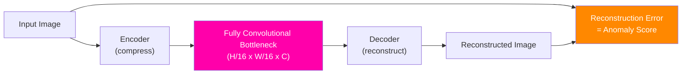
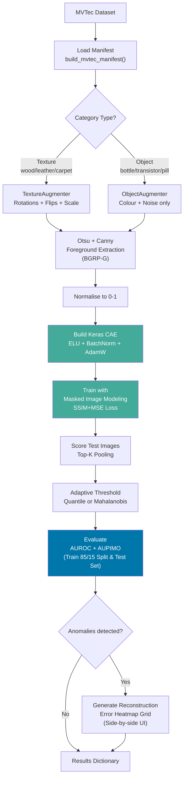

# Keras CAE: Architecture Overview

This is the **entry point** for the Keras CAE documentation. Each of the 10 pipeline steps
is covered in a dedicated sub-page. Start here to understand the big picture, then navigate
to whichever step you want to understand in depth.

---

## What Is a Convolutional Autoencoder?

An **autoencoder** is a neural network with a single unusual training objective: compress
an image into a small internal representation (the **bottleneck**), then reconstruct the
original image from it. There is no external label - the training signal is the difference
between the input and the output.



**Why is this useful for quality control?** The network is trained *only on defect-free
normal images*. It learns to reconstruct normal surfaces well. When a defective image is
fed to it at test time, the model does not know what the defect looks like - it has never
seen one. It tries to reconstruct a normal version of the image and fails. That failure
(the high reconstruction error) is the anomaly signal.

---

## Full Pipeline at a Glance



---

## Module Structure

Each Python module handles one specific concern - no module does more than one job:

| Module | What it does |
|--------|-------------|
| [`augmentation.py`](../../app/pipelines/preprocessing/augmentation.py) | Category-aware data augmentation (texture vs. object strategies) |
| [`segmentation.py`](../../app/pipelines/preprocessing/segmentation.py) | Otsu + Canny foreground extraction and background replacement |
| [`cae_keras.py`](../../app/pipelines/modelling/keras_cae/cae_keras.py) | CAE model definition (`build_cae`), MIM masking, SSIM+MSE loss, training loop |
| [`scoring.py`](../../app/pipelines/evaluation/scoring.py) | Pixel error map computation, Top-K pooling, adaptive thresholds |
| [`evaluation.py`](../../app/pipelines/evaluation/cae_metrics.py) | AUROC, AUPIMO, Precision/Recall/F1, tradeoff curves |
| [`error_heatmap.py`](../../app/pipelines/evaluation/heatmaps.py) | Reconstruction Error Heatmap XAI overlays |
| [`cae_pipeline.py`](../../app/pipelines/modelling/keras_cae/cae_pipeline.py) | End-to-end orchestrator: calls all modules in order |

---

## Step-by-Step Sub-Pages

The 10 pipeline steps are split across focused sub-pages. Each sub-page is self-contained
- you can read any one without reading the others, as long as you understand the overview
above.

| Step | What happens | Sub-page |
|------|-------------|----------|
| **Step 1** | Category-Aware Data Augmentation | [Preprocessing](keras_cae_preprocessing.md) |
| **Step 2** | Image Loading, LANCZOS, RGB, BGRP-G, Otsu, Canny | [Preprocessing](keras_cae_preprocessing.md) |
| **Step 3** | CAE Architecture - Encoder / Decoder layers, ELU, BatchNorm | [Model Architecture & Training](keras_cae_model.md) |
| **Step 4** | Masked Image Modeling (MIM) - identity mapping problem | [Model Architecture & Training](keras_cae_model.md) |
| **Step 5** | SSIM + MSE Loss - why structure matters more than pixels | [Model Architecture & Training](keras_cae_model.md) |
| **Step 6** | AdamW Optimizer - decoupled weight decay, all parameters | [Model Architecture & Training](keras_cae_model.md) |
| **Step 7** | Top-K Pooling - noise-robust image-level scoring | [Inference & Evaluation](keras_cae_inference.md) |
| **Step 8** | Adaptive Threshold - Quantile vs. Mahalanobis | [Inference & Evaluation](keras_cae_inference.md) |
| **Step 9** | Evaluation Metrics - AUROC, F1, AUPIMO | [Inference & Evaluation](keras_cae_inference.md) |
| **Step 10** | Heatmap Explainability | [Explainability](keras_cae_explainability.md) |

Design decision rationale (why not ReLU? why not SAM? why not VAE?) is collected in:
**[Classical Alternatives & Design Decisions](keras_cae_alternatives.md)**

---

## API Endpoint

```
POST /api/pipelines/keras_cae
```

Request body (all fields optional, defaults shown):

```json
{
  "data_root":        "data/raw/mvtec_ad",
  "category":         "bottle",
  "img_size":         128,
  "latent_channels":  32,
  "epochs":           20,
  "batch_size":       16,
  "mask_ratio":       0.25,
  "threshold_method": "quantile",
  "k_fraction":       0.002,
  "use_segmentation": true,
  "run_heatmap":      true,
  "force_retrain":    false
}
```

Response:

```json
{
  "status":   "success",
  "category": "bottle",
  "results": {
    "auroc":            0.91,
    "aupimo":           0.78,
    "accuracy":         0.87,
    "precision":        0.83,
    "recall":           0.90,
    "threshold":        0.043217,
    "final_train_loss": 0.008431,
    "loss_history":     [0.124, 0.087, "..."]
  }
}
```

---

## Dependencies

All core dependencies are already installed in the Pixi environment. TensorFlow is
installed via the Pixi feature system - no manual `pip install` is required:

```bash
# GPU environment (default): installs tensorflow[and-cuda]
pixi install

# CPU environment: installs tensorflow-cpu (AVX2 + oneDNN)
pixi install --environment ci
```

For optional SHAP explainability:

```bash
pixi run pip install shap
```

For details on how TF chooses GPU vs. CPU at runtime, see
[TF Device Selection Architecture](tf_device_selection.md).

---

## References

1. Bergmann, P., et al. (2019). *Improving Unsupervised Defect Segmentation by Applying
   Structural Similarity to Autoencoders.* VISAPP 2019.
2. He, K., et al. (2022). *Masked Autoencoders Are Scalable Vision Learners.* CVPR 2022.
3. Loshchilov, I. & Hutter, F. (2019). *Decoupled Weight Decay Regularization.* ICLR 2019.
4. Clevert, D., Unterthiner, T. & Hochreiter, S. (2016). *Fast and Accurate Deep Network
   Learning by Exponential Linear Units (ELUs).* ICLR 2016.
5. Canny, J. (1986). *A Computational Approach to Edge Detection.* IEEE TPAMI.
6. Otsu, N. (1979). *A Threshold Selection Method from Gray-Level Histograms.* IEEE SMC.
7. Batzner, K., Heckler, L. & Konig, R. (2023). *EfficientAD.* arXiv 2023.
8. Dickson, A. et al. (2024). *AUPIMO: Redefining Visual Anomaly Detection Benchmarks
   with High Speed and Low Tolerance.* ECCV 2024.
9. Kirillov, A. et al. (2023). *Segment Anything.* ICCV 2023.
10. Lundberg, S. M. & Lee, S.-I. (2017). *A Unified Approach to Interpreting Model
    Predictions (SHAP).* NeurIPS 2017.
