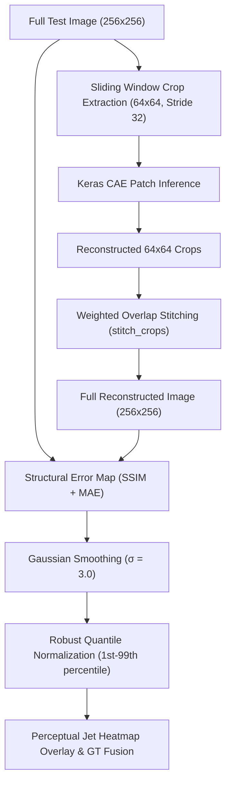

# Keras CAE: Explainability (Reconstruction Error)

> **Part of the Keras CAE documentation series.**

When an anomaly detection model flags an industrial component as defective, the factory operator immediately asks: **"Why?"**

If a model simply says "Anomaly Score: 0.85" without showing *where* the defect is, operators lose trust in the system. Explainable AI (XAI) bridges this gap by generating visual evidence (heatmaps) showing exactly which regions of the image drove the model's decision.

In our Convolutional Autoencoder (CAE) pipeline, the answer to this question is surprisingly elegant and direct: **Reconstruction Error Heatmaps**.

---

## The Power of Reconstruction Error

Many modern AI models (like classifiers) are "black boxes." When they make a decision, we have to use complex approximation techniques like SHAP (game theory) or Grad-CAM (spatial gradients) to guess *why* they made that decision.

However, an Autoencoder is fundamentally different. It is not a black box classifier; it is a **generative reconstructor**.

Think of the autoencoder as having two parts:

- **The Encoder (The Eye):** Looks at the image and extracts complex features (shapes, textures, edges), compressing them into a narrow bottleneck.
- **The Decoder (The Hand):** Tries to redraw the clean, normal image from those compressed features.

Because the model was trained exclusively on *normal*, defect-free components, it only knows how to draw normal components. When it is fed an image with a defect (like a crack or missing pin), the Decoder fails to recreate that specific defect.

Therefore, we don't need complex XAI techniques to guess where the anomaly is. We can simply **subtract the reconstructed image from the original image** to get the pixel-wise error.

This Error Map *is* the Anomaly Score! (Our final anomaly score is mathematically derived by taking the average of the Top-K highest errors in this map).

### Why this is the perfect XAI for the CAE

1. **Mathematically Faithful:** Because the final anomaly score is literally calculated from this error map, the heatmap is a 100% accurate representation of the model's decision process. It is not an approximation.
2. **Blazing Fast:** It requires zero extra computation. The model already produces the reconstruction during the forward pass, meaning the heatmap is generated instantly without any expensive backward passes or sampling.
3. **Pixel-Perfect Resolution:** It highlights defects at the exact resolution of the original image, naturally outlining the exact shape and contours of the crack or scratch.

---

## Technical Architecture: Patch Inference & Error Map Synthesis

### 1. Sliding Window Stitching & Precomputed Inference

The Keras CAE is trained on small local crops (default $64 \times 64$). Full-resolution test images ($256 \times 256$) are divided into overlapping crops with stride 32, passed through the model in batches, and reconstructed into a seamless full-resolution image using weighted overlap blending (`stitch_crops`).

Passing the **precomputed full reconstruction** directly to `compute_error_heatmap()` ensures the model's patch architecture evaluates the entire component without dimension mismatch errors or redundant forward passes.

### 2. Structural Error Formulation

The raw pixel error map $E$ blends Structural Similarity (SSIM) and Mean Absolute Error (MAE):

$$E(x, y) = \alpha \cdot (1 - \text{SSIM}(I(x, y), \hat{I}(x, y))) + (1 - \alpha) \cdot |I(x, y) - \hat{I}(x, y)|$$

- $\alpha = 0.84$: Aligns error calculation with the combined SSIM+MSE training loss.
- **Gaussian Filter ($\sigma = 3.0$):** Smooths high-frequency sensor noise and clusters contiguous defect pixels.
- **Robust Quantile Clamping ($p_1$ to $p_{99}$):** Prevents boundary artifacts and outliers from washing out fine defect signals.

---

## How to Interpret the Heatmaps in the UI

When you run the Keras CAE pipeline, the **Reconstruction Error Explorer** is generated automatically at the end of the evaluation. It presents a side-by-side gallery of vibrant, slightly smoothed heatmaps overlaid onto the original anomalous images, paired with their respective Ground Truth masks.

### Side-by-Side Visualization Grid

The Streamlit UI displays a comparative grid for each anomalous test image:

- **Left Panel (Prediction Heatmap):** The original image overlaid with the model's predicted anomaly heatmap.
- **Right Panel (Ground Truth + Heatmap):** The Ground Truth defect contour fused with the anomaly heatmap.

This side-by-side layout allows for immediate visual validation of the model's localization accuracy (AUPIMO) in a rectangular, easily scannable format rather than a long vertical scroll.

We use a perceptual colourmap (typically "jet") blended with the original image, with transparency allowing the underlying component to show through:

- 🔴 **Red / Warm Colours:** Highest reconstruction error. This is the **strongest evidence of an anomaly**. The model completely failed to recreate this region because it looks nothing like the normal training data.
- 🟡 **Yellow / Orange:** Moderate error. The model struggled slightly to recreate this texture or edge.
- 🔵 **Blue / Cool Colours:** Low error. The model successfully recreated this region, indicating it considers it completely normal.
- **Transparent / Original Image:** Wherever the error is near zero, the heatmap is fully transparent, allowing you to clearly see the normal parts of the component.

By overlaying this heatmap, operators can instantly verify if the model flagged a genuine defect (like a scratch) or if it was confused by a benign factor (like a shadow).

---

## Lessons Learned: The "Red Ring" Min-Max Bug

While building this pipeline, we encountered a fascinating bug where the heatmaps for *every single image* looked like a perfect red ring (a vignette), completely missing the actual defects. This was a classic ML pipeline bug caused by two intersecting issues:

1. **The Double-Division Pipeline Bug:** During evaluation, the test images were correctly normalized to `[0, 1]`. However, the heatmap visualizer accidentally took these `[0, 1]` images and divided them by 255 *again* before feeding them to the autoencoder. The model received pitch-black images (values between 0.0 and 0.003). Because it had never seen a pitch-black bottle during training, it failed completely.
2. **The Min-Max Vulnerability:** The original heatmap code normalized the error map by finding the absolute minimum and maximum pixels in the entire image and stretching them from 0 to 1. Because we use Otsu+Canny to mask the background to pure black, the highest reconstruction error was *always* at the high-contrast edge between the bottle and the pitch-black background. This caused the rim of the bottle to become `1.0` (pure red), forcing the actual tiny defect (which had a smaller absolute error than the sharp background edge) to get squashed down to `0.0` (invisible).

### The Fix

This taught us two critical MLOps lessons for Explainable AI:

- **Always verify your pipeline inputs:** The model was perfectly fine, but the data fed into the XAI module was corrupted.
- **Use robust statistics for XAI:** We fixed the heatmap by replacing the naive `[min, max]` normalisation with **robust quantile clamping** (1st to 99th percentile). By clipping extreme outlier pixels (like the sharp background edge), the actual defect is allowed to shine through as the true anomaly!
