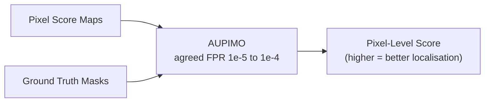

# Keras CAE: Inference & Evaluation

> **Part of the Keras CAE documentation series.** Start at the
> [Architecture Overview](keras_cae_architecture.md) if you are new to this pipeline.

This page covers **Steps 7-9**: how a trained model is turned into a reliable anomaly
detector through noise-robust scoring (Top-K pooling), calibrated thresholding (Quantile
vs. Mahalanobis), and honest evaluation (AUROC, F1, AUPIMO).

**Implementation files**:

- [`scoring.py`](file:///home/benni/Documents/antigravity_workspace/industrial-component-anomaly-detection/app/pipelines/multi_stage_ae/scoring.py) - pixel error maps, Top-K, thresholds
- [`evaluation.py`](file:///home/benni/Documents/antigravity_workspace/industrial-component-anomaly-detection/app/pipelines/multi_stage_ae/evaluation.py) - AUROC, AUPIMO, Precision/Recall/F1

---

## Step 7: Top-K Pooling for Image-Level Anomaly Scoring

### Where in the Pipeline Does Scoring Happen?

After training, the model runs in **inference mode** with no masking - the original,
clean test images are fed directly to the encoder-decoder. For each test image, the
reconstruction $\hat{X}$ is compared pixel-by-pixel to the original $X$ to produce a
**pixel error map**:

$$E(i, j) = \frac{1}{C} \sum_{c=1}^{C} |X_{i,j,c} - \hat{X}_{i,j,c}|$$

This gives a 2D map of the same spatial dimensions as the image (128x128), where each
value represents how well the model reconstructed that pixel.

**Higher value = the model struggled here = likely anomalous.**

To make a binary classification decision ("is the whole image defective?"), the 2D map
must be collapsed into a single scalar score. The choice of pooling method dramatically
impacts detection reliability.

### The Naive Approach: Max-Pooling - Why It Fails

$$S_{\text{max}} = \max_{i,j} E(i,j)$$

The maximum pixel error is a conceptually obvious choice but has a catastrophic flaw:
a single "hot" pixel from camera sensor noise (a dead pixel randomly firing), a JPEG
compression artefact, or dust on the optical lens produces one single extremely high
reconstruction error at that pixel. The maximum is dominated by this noise, giving a high anomaly score to a perfectly good component. **A false positive caused by sensor noise, not a defect.** Industrial cameras running 24/7 in dusty manufacturing environments always have sensor noise. Max-pooling is incompatible with real-world deployment.

### Mean Pooling - Why That Also Fails

$$S_{\text{mean}} = \frac{1}{H \cdot W} \sum_{i,j} E(i,j)$$

Mean pooling has the opposite problem: it dilutes small defects. A 5x5 pixel scratch
(fully visible to a human inspector, a real reject) on a 128x128 image:

- Covers 25 pixels out of 16,384 total (0.15% of the image).
- Defect error: 0.9, background error: 0.01.
- Mean score: $(25 \times 0.9 + 16359 \times 0.01) / 16384 = 0.021$.

A score of 0.021 is below any meaningful threshold. The defect is **completely invisible**
to mean pooling.

### Top-K Pooling: The Correct Balance

$$S_{\text{top-K}} = \frac{1}{K} \sum_{p \in \text{top-}K \text{ pixels}} E(p)$$

With $K = \lfloor k_\text{fraction} \times H \times W \rfloor$, where `k_fraction = 0.002`.

For 128x128 images: $K = 0.002 \times 16384 = 33$ pixels.

**What happens to the other 16,351 pixels?** They are discarded entirely. The image score
is computed exclusively from the 33 highest-error pixels. Every other pixel contributes
exactly zero to the decision.

**Why this is correct**:

- **Against sensor noise**: A single noisy pixel is 1 of 33 in the top-K average. Its contribution is diluted by $1/33$. The other 32 slots are filled by the next-highest error pixels - which, in the absence of a real defect, are just normal high-variation texture pixels, not outliers. The average stays low.
- **For small defects**: A 5x5 pixel scratch (fully visible to a human inspector, a real reject) on a 128x128 image:

    - Covers 25 pixels out of 16,384 total (0.15% of the image).
    - Defect error: 0.9, background error: 0.01.
    - Mean score: $(25 \times 0.9 + 16359 \times 0.01) / 16384 = 0.021$.

A score of 0.021 is below any meaningful threshold. The defect is **completely invisible**
to mean pooling.

### Top-K Pooling: The Correct Balance

$$S_{\text{top-K}} = \frac{1}{K} \sum_{p \in \text{top-}K \text{ pixels}} E(p)$$

With $K = \lfloor k_\text{fraction} \times H \times W \rfloor$, where `k_fraction = 0.002`.

For 128x128 images: $K = 0.002 \times 16384 = 33$ pixels.

**What happens to the other 16,351 pixels?** They are discarded entirely. The image score
is computed exclusively from the 33 highest-error pixels. Every other pixel contributes
exactly zero to the decision.

**Why this is correct**:

- **Against sensor noise**: A single noisy pixel is 1 of 33 in the top-K average. Its contribution is diluted by $1/33$. The other 32 slots are filled by the next-highest error pixels - which, in the absence of a real defect, are just normal high-variation texture pixels, not outliers. The average stays low.
- **For small defects**: A 5x5 scratch (25 pixels) with error 0.9 dominates the top-33 pool: 25 out of 33 slots come from the defect cluster. The score is approximately $(25 \times 0.9 + 8 \times 0.05) / 33 \approx 0.70$ - strongly anomalous.

**The core principle**: Real industrial defects are physically contiguous - cracks, scratches, and contamination always affect many adjacent pixels as a cluster. Sensor noise is isolated - individual dead pixels are spatially separated. Top-K pooling requires a *cluster* of high-error pixels to produce a high score.

```
Concrete comparison on 128x128 with a 5x5 defect:
  25 defect pixels at error 0.9 | 16,359 background pixels at error 0.01
  + 1 noise spike pixel at error 0.95

  Max score:    0.95  ✗  (noise spike wins over defect)
  Mean score:   0.02  ✗  (defect diluted to near-zero)
  Top-K(33):    0.70  ✓  (defect cluster dominates; noise spike is 1 of 33)
```

---

## Step 8: Adaptive Threshold

### Why a Threshold at All?

The autoencoder outputs a continuous mathematical anomaly score for each image (e.g., 0.04, 0.25, 1.8). A factory operator cannot act on a floating-point number. They require a binary business decision: **Pass (Good)** or **Reject (Defective)**.

The threshold is the exact cutoff line that translates the continuous score into a definitive classification:

- Score **<= Threshold** -> Normal / Good
- Score **> Threshold** -> Anomalous / Defective

Because the baseline reconstruction loss varies drastically between different types of objects (e.g., complex textured carpets have a naturally higher baseline loss than smooth metal screws), we cannot hardcode a universal static threshold (e.g., `threshold = 0.5`). The threshold must be **adaptive** and calibrated dynamically for each product category based on its unique "normal" baseline.

### Quantile vs. Mahalanobis

| Method | Formula | When to use |
|--------|---------|-------------|
| **Quantile** | 95th percentile of normal scores | Non-Gaussian distributions, outlier-robust |
| **Mahalanobis** | $\mu + 3\sigma$ of normal scores | Approximately Gaussian distributions |

**What is the Mahalanobis method here?** It is the standard Gaussian approach - it assumes that the anomaly scores of normal images follow a bell curve (Gaussian distribution) and sets the threshold at Mean + 3 Standard Deviations ($\mu + 3\sigma$). By the empirical rule, this encompasses 99.7% of all normal data.

**Why Quantile is preferred**: In deep learning anomaly detection, reconstruction errors are rarely perfectly Gaussian. They are often right-skewed with long tails - a small fraction of normal images happen to have slightly higher reconstruction error due to complex surface regions. If the normal scores are skewed, the Gaussian assumption $\mu + 3\sigma$ will place the threshold far too high (causing you to miss real defects) or too low (causing false alarms).

The **Quantile** method is *non-parametric* - it makes zero assumptions about the shape of the distribution. It simply sorts the normal scores and draws the line exactly where 95% of the normal images sit. This is entirely robust to skewed, non-Gaussian distributions and extreme outliers.

**Important**: Both methods are calibrated exclusively from **known-good normal test images** - not from the whole test set. This ensures the threshold is not artificially inflated by defective examples, which would cause the model to miss real defects.

---

## Step 9: Evaluation Metrics

Getting the right evaluation metric is as important as the model itself. The wrong metric can make a poor detector appear excellent, and a genuinely good detector appear mediocre. We evaluate at two distinct levels.

---

### Image-Level: Is the Entire Component Defective?

#### AUROC - Threshold-Free Ranking Quality

**AUROC** (Area Under the Receiver Operating Characteristic Curve) evaluates the model's ability to **rank** anomalous images above normal ones without choosing a specific threshold.

First, understand what a ROC curve is: for each possible threshold value (from very high to very low), we compute:

- **TPR (True Positive Rate / Recall)**: Out of all actual defects, what fraction did we score above the threshold? (= fraction of defects correctly flagged)
- **FPR (False Positive Rate)**: Out of all actual normal images, what fraction did we score above the threshold? (= fraction of normals incorrectly flagged as defects)

As the threshold sweeps from highest to lowest, every possible operating point is traced.
The resulting curve is the **ROC curve**. The **AUROC** is the area under it:

- **AUROC = 1.0**: Perfect ranking - every defective image scores higher than every normal image. You can always find a threshold that catches 100% of defects with 0% false alarms.
- **AUROC = 0.5**: Random - the model is no better than a coin flip.
- **AUROC = 0.0**: Perfectly inverted - the model ranks defects *below* normals (this would actually be useful if you flip the threshold).

**The imbalance trap**: MVTec test sets are often imbalanced: a category may have 80 normal images and only 20 defective images. AUROC can appear deceptively optimistic here. A model that correctly identifies the 80 easy normal images (because they are easy to reconstruct) but misses most defects can still achieve AUROC > 0.8. This is not a meaningful success.

**Why we still use AUROC**: It is threshold-independent and captures the full operating range, making it useful for literature comparison. But it must be read alongside Precision, Recall, and F1 at the chosen operating point.

#### Precision, Recall, Accuracy, and F1 - At the Adaptive Threshold

Once the adaptive threshold is set (Step 8), every test image receives a binary prediction: **Normal (0)** or **Anomalous (1)**. Metrics are computed with **Anomalous as the positive class** (`pos_label=1`) - the correct industrial convention, since we are trying to *detect defects*, and a defect is the "positive" event.

| Metric | Formula | Meaning in plain English |
|---|---|---|
| **Accuracy** | $(TP + TN) / N$ | Fraction of all images correctly classified |
| **Precision** | $TP / (TP + FP)$ | Of all images flagged as defective, how many actually were? |
| **Recall** | $TP / (TP + FN)$ | Of all actual defects, how many did we catch? |
| **F1-Score** | $2 \cdot P \cdot R / (P + R)$ | Harmonic mean of Precision and Recall |

Where:

- $TP$ = True Positives: defective images correctly flagged as anomalous
- $TN$ = True Negatives: normal images correctly passed as good
- $FP$ = False Positives: normal images incorrectly rejected (false alarms)
- $FN$ = False Negatives: defective images missed (escaped defects)

**Why F1 instead of Accuracy?** Accuracy is misleading on imbalanced datasets. If the test set has 80% good parts and 20% defective, a model that predicts "good" for everything achieves 80% accuracy while having 0% Recall - zero defects caught. F1 penalises both missing defects (low Recall) and false alarms (low Precision) equally, making it a more honest single-number summary.

**The Precision-Recall trade-off**: Increasing recall (catching more defects) inevitably increases false alarms (lower precision). The threshold controls this trade-off. A **Precision-Recall curve** plots all trade-off points; the **PR-AUC** (area under this curve) summarises performance across all operating points without picking a threshold. On imbalanced datasets, PR-AUC is typically lower and more honest than AUROC.

---

### Pixel-Level: Does the Model Localise WHERE the Defect Is?

Pixel-level evaluation requires **ground truth defect masks** (binary maps where `1 = defect pixel`, `0 = normal pixel`), which MVTec AD provides for all defective images.

#### AUPIMO (Area Under Per-Image Overlap) - The Right Metric for Industrial Use

Standard pixel evaluation metrics (like PRO-score / AUPRO) integrate pixel overlap at all FPR values up to a loose 30% threshold. In a factory inspecting 10,000 parts per day, 30% FPR means 3,000 good parts incorrectly rejected per day. This is completely unacceptable.

AUPIMO integrates per-image pixel overlap only within an extremely tight, industrially realistic FPR range:

$$\text{FPR} \in [10^{-5},\; 10^{-4}]$$

This corresponds to 1 false alarm per 10,000 to 100,000 inspected pixels of normal surface area - the kind of false alarm rate that quality engineers actually demand in automotive, electronics, and pharmaceutical manufacturing.



**What does AUPIMO = 0.5 mean?** At the strict industrial FPR operating range, the model's predicted anomaly map overlaps 50% of the actual ground truth defect pixels on average. This is already a very demanding standard. Values above 0.7 indicate strong localisation.

**Critical distinction - image-level vs. pixel-level threshold**: The image-level adaptive threshold from Step 8 (Quantile/Mahalanobis) decides whether the *entire image* is flagged. The AUPIMO metric operates with its own internal pixel-level threshold sweep. These are independent. The Precision and Recall values shown in the Streamlit UI metric cards refer to the **image-level** adaptive threshold - not the AUPIMO pixel threshold.

> **NOTE**: AUPIMO is provided by the `anomalib` library, which is already a dependency
> of this project.

---

## What Comes Next

After evaluation, you can request optional **Reconstruction Error Heatmaps** on individual anomalous images.

Continue reading: **[Explainability (Reconstruction Error) ->](keras_cae_explainability.md)**

For the rationale behind each design decision (why not PRO-score? why not Pixel-AUROC?):
**[Classical Alternatives & Design Decisions ->](keras_cae_alternatives.md)**

---

## References

- Dickson, A. et al. (2024). *AUPIMO: Redefining Visual Anomaly Detection Benchmarks
  with High Speed and Low Tolerance.* ECCV 2024.
- Bergmann, P., et al. (2019). *Improving Unsupervised Defect Segmentation by Applying
  Structural Similarity to Autoencoders.* VISAPP 2019.
