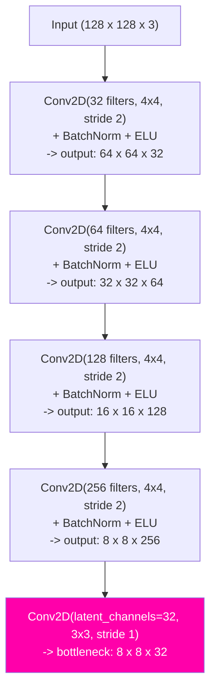
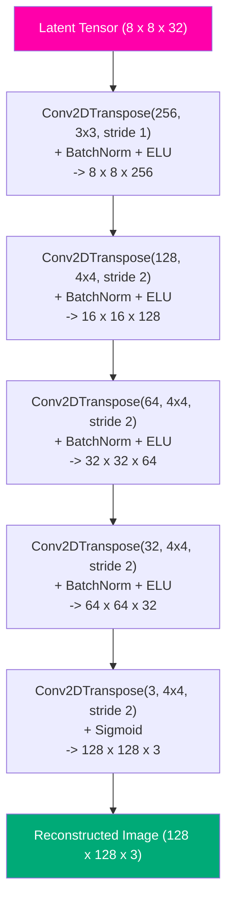
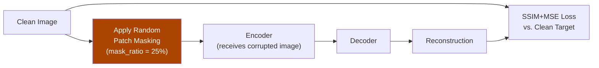
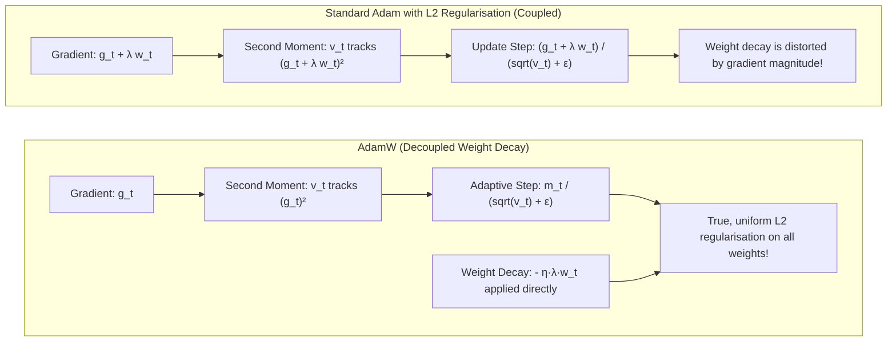

# Keras CAE: Model Architecture & Training

> **Part of the Keras CAE documentation series.** Start at the [Architecture Overview](keras_cae_architecture.md) if you are new to this pipeline.

This page covers **Steps 3-6**: the encoder-decoder network structure, why identity mapping is a fatal problem, the SSIM+MSE loss function, and the AdamW optimizer. All code lives in [`cae_keras.py`](../../app/pipelines/modelling/keras_cae/cae_keras.py) - the model definition (`build_cae`), the MIM masking (`apply_patch_masking`), the loss function, and the training loop are all in this single file.

---

## Step 3: CAE Architecture

### What Does "Convolutional" Mean?

Convolutional layers scan the image with small filters (e.g., 4x4 pixels) that slide across the entire image, detecting local patterns like edges, colour transitions, and texture repetitions. Unlike fully-connected layers that treat every pixel independently, convolutional layers share filter weights across all spatial positions - this is what makes them efficient on images.

### ELU Activations - Why Not ReLU?

After every convolutional layer, a non-linear **activation function** is applied. Without non-linearity, a stack of 10 convolutional layers is mathematically identical to 1 convolutional layer - the whole network collapses into a single linear transformation that cannot learn complex patterns.

**ReLU** (Rectified Linear Unit, `max(0, x)`) is the most common activation, but suffers from the *Dying ReLU* problem: any neuron that receives consistently negative inputs produces output 0 permanently. Its gradient is exactly 0 for all negative inputs, so it receives no update signal from backpropagation and becomes permanently inactive, losing all learning capacity. In deep autoencoders, this can affect 10-30% of all neurons.

**ELU** (Exponential Linear Unit) solves this:

$$\text{ELU}(x) = \begin{cases} x & x > 0 \\ \alpha(e^x - 1) & x \leq 0 \end{cases}$$

With $\alpha = 1.0$, ELU:

- **Never kills a neuron**: The negative branch smoothly saturates toward $-\alpha$ (= -1.0) instead of hard-zeroing. A small gradient always flows through.
- **Pushes mean activations toward zero**: The negative mean-compensation effect produces zero-centred activations, reducing the need for aggressive normalisation.
- **Converges faster**: Empirically 10-30% fewer epochs needed to reach the same loss on reconstruction tasks compared to ReLU.

See [Classical Alternatives & Design Decisions](keras_cae_alternatives.md) for the full comparison table of activation functions.

### Encoder Architecture

The encoder compresses the input image down to a compact **latent vector** (the bottleneck). It does this through four strided convolutional layers, each halving the spatial dimensions while doubling the number of filters:



**BatchNorm**: After each convolution, Batch Normalisation re-centres and re-scales the activations to have zero mean and unit variance across the current batch. This stabilises training on small MVTec datasets (60-400 images per category) by preventing gradient explosion and vanishing. It also allows for higher learning rates and makes the network less sensitive to initialisation.

**`use_bias=False`**: Notice that every convolution sets `use_bias=False`. This is a mathematical optimization. Because Batch Normalization immediately follows the convolution, it will compute the mean of the activations and subtract it. Any constant bias added by the convolution would simply be subtracted out entirely by the Batch Norm layer. Setting `use_bias=False` removes these redundant parameters, saving memory and compute, while letting Batch Normalization's own learned shift parameter ($\beta$) act as the true bias.

**Stride 2**: Instead of a separate pooling step, stride-2 convolutions learn to downsample. This is preferable because the learned downsampling preserves more task-relevant information than fixed max-pooling.

### Why a Fully Convolutional Bottleneck (FCAE)?

**The Rationale & Expectation:**
In a classic autoencoder, the bottleneck is flattened into a 1D dense vector. The critical flaw of this approach for image anomaly detection is that flattening destroys spatial topology. An 8x8 image patch becomes a 1D list of numbers, and the decoder is forced to "re-learn" spatial coordinates and 2D relationships entirely from scratch to project it back into an image.
By replacing the dense layer with a **Fully Convolutional Bottleneck** (maintaining an `8 x 8 x 32` tensor), the network inherently preserves the $x, y$ spatial structure of the image at its most compressed state.
We expect this to dramatically improve the reconstruction of high-frequency, non-anomalous textures and sharp edges. When normal textures are reconstructed sharply, they produce zero error, virtually eliminating false-positive anomaly spikes along the edges of components.

**The Risk (Capacity Balancing):**
The primary risk of an FCAE is **excessive bottleneck capacity**. If `latent_channels` is set too high (e.g., 256 or 512), the bottleneck becomes wide enough to act as a near-perfect identity mapping channel. If the model has enough capacity to easily compress and reconstruct *anything* (including anomalies it has never seen), defective regions will be reconstructed perfectly, yielding low error scores, and causing us to completely miss real defects (False Negatives).
By tuning `latent_channels=32`, we strike the exact balance: enough capacity to reconstruct normal textures sharply, but narrow enough to force the model to "forget" anomalous structures.

### Decoder Architecture

The decoder mirrors the encoder using **transposed convolutions** (sometimes called "deconvolutions" - this term is technically incorrect, but you may encounter it in the literature). Each transposed convolution doubles the spatial dimensions:



**Sigmoid activation on the output**: The final layer uses Sigmoid (which maps any input to [0, 1]) instead of ELU. This forces all output pixel values to the valid image range [0, 1] (after normalisation). If ELU were used at the output, the network could produce negative pixel values, which have no meaning and confuse the loss function.

---

## Step 4: Masked Image Modeling (MIM)

**Implementation**: [`cae_keras.py: apply_patch_masking`](../../app/pipelines/modelling/keras_cae/cae_keras.py#L312-L364) and the `train_cae` training loop in the same file.

There is no separate `cae_dataset.py` - all training-time data augmentation (masking, shuffling) happens directly within the `train_cae` training loop in `cae_keras.py`.

### The Trivial Identity Mapping Problem

A naive autoencoder trained to copy its input to its output learns nothing useful. Given a perfect input $X$, the easiest solution the network can find is the identity function $f(X) = X$ - pass every pixel through unchanged.

This is not a hypothetical concern. On small datasets like MVTec (60-400 training images), identity-mapping autoencoders are exactly what gradient descent converges to within a few epochs. The loss drops fast and early... because the model is not learning "what is normal", it is learning to copy. At test time, a defective image is also copied faithfully, producing the same low reconstruction error as a normal image. **The anomaly detector fails completely.**

### The MAE-Inspired Solution: Force Context Learning

Inspired by **Masked Autoencoders (MAE, He et al., 2022)**, we randomly erase square patches of the input image *before* it enters the encoder. The model is still required to reconstruct the *original complete image* - not the corrupted one:

- **Model input**: $X_{\text{masked}}$ - the clean image with `mask_ratio` fraction of patches zeroed out
- **Training target**: $X_{\text{clean}}$ - the original, unmasked image

This makes identity mapping **structurally impossible**: the encoder receives holes in the image, but the decoder must fill them in completely. The model must infer what belongs in the masked region from the surrounding context - learning the structural grammar of normal surfaces: how textures continue, how edges align, how components are shaped.



### How Patches Are Structured

For a 128x128 image with `patch_size=16`:

- The image is divided into an **8x8 grid** of 64 non-overlapping patches, each 16x16 pixels.
- With `mask_ratio=0.25`, exactly **16 patches** (25% of 64) are randomly selected and zeroed per image per batch step.
- The selection is **re-randomised independently for each image in the batch** - no two images ever have the same masked regions, providing maximum diversity.

```text
Example: 128x128 image -> 8x8 = 64 patches of 16x16.
Each 'X' = masked (zeroed to black), '.' = visible:

. . X . . X . .
. X . . X . . .
X . . . . . X .
. . X . . . . X
. . . X . . X .
X . . . X . . .
. . X . . . . .
. X . . . X . .
```

### The Training Step in Code

```python
for start in range(0, n_samples, batch_size):
    batch_clean = train_images[batch_indices]  # Target: original images
    batch_masked = apply_patch_masking(  # Input: corrupted images
        batch_clean, mask_ratio=0.25, patch_size=16
    )
    # Key: model input != training target!
    loss = model.train_on_batch(batch_masked, batch_clean)
```

The key line is `model.train_on_batch(batch_masked, batch_clean)` - the model receives the *masked* image but is evaluated against the *clean* image. This separation of input and target is the entire mechanism.

### Why 16x16 Patches?

The `patch_size=16` follows the Vision Transformer (ViT) and MAE convention. At 128x128, a 16x16 patch covers 1.56% of the image - large enough to force reasoning about structure (you cannot reconstruct a 16x16 patch by copying adjacent pixels), but small enough that 25% masking still leaves 75% of the image visible as context.

- **Smaller patches (e.g., 4x4)**: Easier to reconstruct from immediate neighbours; the model never needs to learn long-range structure. MIM becomes trivial.
- **Larger patches (e.g., 32x32)**: Each masked region covers 6.25% of the image; 25% masking removes 4 very large regions, leaving insufficient context and causing training instability.

### At Inference Time: No Masking

At inference time, **no masking is applied at all** - the original clean test image is fed directly to the encoder. The model, having learned during training to fill in missing structure from context, now encounters something new: an anomalous region that has no topological relationship to the normal surface grammar it learned. The decoder attempts to reconstruct what *should* be there - and fails. That failure is captured as high reconstruction error in the anomaly heatmap.

---

## Step 5: Combined SSIM + MSE Loss

The choice of reconstruction loss function is one of the most consequential design decisions in the pipeline. The wrong loss produces a model that optimises for the wrong thing and generates anomaly maps too noisy to be useful.

### What Is MSE and Why Is It Not Enough Alone?

**Mean Squared Error (MSE)** computes the average squared difference between original and reconstructed image at every pixel, independently:

$$\text{MSE}(X, \hat{X}) = \frac{1}{H \cdot W \cdot C} \sum_{i,j,c} \left(X_{i,j,c} - \hat{X}_{i,j,c}\right)^2$$

**What MSE measures well**: Photometric brightness and absolute colour accuracy. If the reconstruction has the right colours in the right places, MSE is low.

**The critical flaw of MSE alone**: MSE treats every pixel as **completely independent**. It has zero concept of spatial structure, edges, or textures. This causes two problems:

1. **Spatial shifts are catastrophically penalised**: If the reconstructed texture is shifted by even 1 pixel (due to subpixel misalignment in reconstruction), MSE reports a high error across the entire image - even though the image looks completely correct. This artificially elevates reconstruction error on normal images, effectively hiding real defects behind noisy baselines.
2. **Texture quality is invisible to MSE**: If a uniform grey patch replaces a wood-grain texture region, MSE might be near-zero if the average grey value matches - but the structural content is gone. MSE cannot detect structural destruction.

### What Is SSIM and Why Does It Help?

**SSIM** (Structural Similarity Index Measure, Wang et al. 2004) evaluates image quality across three complementary dimensions computed over a local sliding window:

$$\text{SSIM}(x, y) = \underbrace{\left(\frac{2\mu_x \mu_y + c_1}{\mu_x^2 + \mu_y^2 + c_1}\right)}_{\text{Luminance}} \cdot \underbrace{\left(\frac{2\sigma_x \sigma_y + c_2}{\sigma_x^2 + \sigma_y^2 + c_2}\right)}_{\text{Contrast}} \cdot \underbrace{\left(\frac{\sigma_{xy} + c_3}{\sigma_x \sigma_y + c_3}\right)}_{\text{Structure}}$$

- **Luminance**: Compares the mean intensities ($\mu_x$, $\mu_y$) of a local 11x11 pixel window. Are the two patches equally bright?
- **Contrast**: Compares the standard deviations ($\sigma_x$, $\sigma_y$). Do the patches have a similar range of bright and dark values?
- **Structure**: Compares the cross-correlation ($\sigma_{xy}$) of pixel deviations. Do the patches have the same spatial pattern of light and dark - the same local texture?

$c_1$, $c_2$, $c_3$ are small constants that prevent division by zero in flat regions.

**The crucial difference**: SSIM is computed over an 11x11 sliding window - a local neighbourhood. A 1-pixel spatial shift that devastates MSE barely affects SSIM, because the structural pattern of the 11x11 window is almost identical before and after the shift. SSIM captures perceptual image quality, not per-pixel algebraic distance.

SSIM returns values in $[-1, 1]$ where $1.0$ = identical. We use $(1 - \text{SSIM})$ as the loss term so that lower values mean better reconstruction:

```python
ssim_per_image = tf.image.ssim(y_true, y_pred, max_val=1.0)  # per-image similarity
ssim_loss = 1.0 - tf.reduce_mean(ssim_per_image)  # loss: 0 = perfect
```

### The Combined Loss

$$\mathcal{L}(X, \hat{X}) = \underbrace{\alpha \cdot (1 - \text{SSIM}(X, \hat{X}))}_{\text{Structural fidelity}} + \underbrace{(1-\alpha) \cdot \text{MSE}(X, \hat{X})}_{\text{Pixel accuracy}}$$

With $\alpha = 0.84$: 84% weight on structural similarity, 16% on pixel accuracy.

| Loss Component | What it measures | Weakness alone |
|---|---|---|
| **MSE** | Per-pixel squared brightness error | Ignores structure; punishes 1-pixel shifts |
| **SSIM** | Local luminance + contrast + structure | Can miss large uniform colour errors |
| **L1 / MAE** | Per-pixel absolute error | Same spatial blindness as MSE |
| **Perceptual (VGG)** | VGG-16 semantic feature distances | Requires 550MB extra model; captures semantics not surface texture |
| **SSIM + MSE (chosen)** | Structure + pixel accuracy | Complementary strengths, no extra dependencies |

**Why $\alpha = 0.84$?** Bergmann et al. (2019) ran systematic ablation studies across all 15 MVTec categories, testing every $\alpha$ from 0.0 (pure MSE) to 1.0 (pure SSIM). They found $\alpha = 0.84$ consistently delivered the best anomaly segmentation across both texture and object categories. The 84% structural emphasis captures texture anomalies that MSE misses, while the 16% MSE term ensures the model produces numerically accurate colour values and does not produce systematic colour bias in reconstructions.

---

## Step 6: AdamW Optimizer

### What Is an Optimizer?

During training, after computing how wrong the reconstruction is (via the loss function), we need an algorithm to update the millions of network weights to make the reconstruction better. This algorithm is the **optimizer**. Different optimizers have very different behaviour in how they update weights, how fast they converge, and how well they generalise.

### The Problem with Standard Adam

**Standard Adam** (Adaptive Moment Estimation) is the most popular optimizer in deep learning. It adapts the learning rate individually for each parameter based on the history of that parameter's gradients. This makes it converge much faster than plain Stochastic Gradient Descent (SGD). However, it has a subtle but serious flaw when used with $L_2$ regularisation (weight decay).

$L_2$ regularisation is a technique to prevent overfitting by adding a penalty $\frac{1}{2} \lambda \|w\|^2$ to the loss function. This forces weights to stay small, preventing the network from memorising the training set. In theory, adding $L_2$ to the loss is equivalent to applying weight decay.

But in **standard Adam**, the $L_2$ gradient penalty $\lambda w_t$ is folded directly
into the gradient:

$$\tilde{g}_t = g_t + \lambda w_t$$

This contaminated gradient then flows into Adam's second moment calculation $v_t$, which
tracks gradient magnitudes. The weight decay term gets divided by $\sqrt{\hat{v}_t}$:

$$\text{Standard Adam Update} \approx w_t - \frac{\eta_t}{\sqrt{\hat{v}_t} + \epsilon} \cdot (g_t + \lambda w_t)$$

This causes two severe problems:

1. **Suppressed regularisation on active weights**: Weights with large gradients have large $\hat{v}_t$, meaning their weight decay term is divided by a large number and becomes **ineffective**. The most active weights receive almost no regularisation.
2. **Excessive regularisation on inactive weights**: Weights with tiny gradients have very small $\hat{v}_t$, so their weight decay is amplified excessively.

**The result**: weight decay becomes non-uniform and effectively random across the network, providing neither consistent regularisation nor consistent update scaling. On small datasets like MVTec (60-400 images), this breaks generalisation.

### How AdamW Fixes This

**AdamW** (Loshchilov & Hutter, 2017) fixes the problem by **decoupling weight decay from the gradient computation entirely**:



The gradient $g_t$ remains pure (only reconstruction loss gradients). Weight decay is applied directly to $w_t$ outside the adaptive fraction. Every single parameter in the autoencoder receives genuine, proportional $L_2$ regularisation regardless of how frequently or intensely its gradients fire.

### The Full Mathematical Formulation

At each training iteration $t$:

1. **Gradient Computation**:

    $$g_t = \nabla_{w} \mathcal{L}(w_t)$$

2. **First Moment Vector (Moving Average of Gradients - Direction & Momentum)**:

    $$m_t = \beta_1 \cdot m_{t-1} + (1 - \beta_1) \cdot g_t$$

3. **Second Moment Vector (Moving Average of Squared Gradients - Curvature & Scale)**:

    $$v_t = \beta_2 \cdot v_{t-1} + (1 - \beta_2) \cdot g_t^2$$

4. **Bias Corrections** (correcting for zero-initialisation at early steps):

    $$\hat{m}_t = \frac{m_t}{1 - \beta_1^t}, \qquad \hat{v}_t = \frac{v_t}{1 - \beta_2^t}$$

5. **Weight Update with Decoupled Weight Decay**:

    $$w_{t+1} = \underbrace{(1 - \eta_t \lambda) \cdot w_t}_{\text{Direct shrinkage}} - \underbrace{\frac{\eta_t}{\sqrt{\hat{v}_t} + \epsilon} \cdot \hat{m}_t}_{\text{Adaptive gradient step}}$$

### Parameter Reference

| Symbol | Name | Codebase Value | Intuition |
|:---|:---|:---|:---|
| $w_t$ | Current Weight | Model parameters | The filter/dense values at step $t$ |
| $g_t$ | Stochastic Gradient | $\nabla_w \mathcal{L}(w_t)$ | Direction of steepest loss increase on this batch |
| $m_t$ | First Moment | Moving average of gradients | Momentum - which direction have gradients consistently pointed? |
| $v_t$ | Second Moment | Moving average of $g_t^2$ | How large/volatile are this parameter's gradients? |
| $\hat{m}_t$, $\hat{v}_t$ | Bias-Corrected Moments | Derived | Corrects for zero-initialisation at $t=0$ |
| $\beta_1$ | First Moment Decay | `0.9` (TF default) | 90% historical momentum retained; 10% from current batch |
| $\beta_2$ | Second Moment Decay | `0.999` (TF default) | Averages gradient magnitudes over ~1000 steps |
| $\eta_t$ | Learning Rate | `1e-3`, adaptive | Global step size; reduced by ReduceLROnPlateau |
| $\lambda$ | Weight Decay | `1e-4` in `build_cae()` | Regularisation strength; 0.01% shrinkage per batch |
| $\epsilon$ | Epsilon | `1e-7` (TF default) | Prevents division by zero when $\hat{v}_t \approx 0$ |

### Configuration in Code

```python
import tensorflow as tf

optimizer = tf.keras.optimizers.AdamW(
    learning_rate=1e-3,  # eta: initial step size
    weight_decay=1e-4,  # lambda: decoupled shrinkage rate
    beta_1=0.9,  # momentum exponential decay factor
    beta_2=0.999,  # second moment variance decay factor
    epsilon=1e-7,  # numerical stability constant
)

model.compile(
    optimizer=optimizer,
    loss=ssim_mse_loss(alpha=0.84),
)
```

### Training Callbacks: Early Stopping, Checkpoint, and LR Plateau

The custom training loop implements three critical optimisation controls:

#### 1. Early Stopping vs. Fixed Epochs

Fixed epochs risk either underfitting (model hasn't converged) or overfitting (model has started memorising training-set noise). We monitor the validation loss on unseen normal images (`val_good`) with a high patience (e.g., 20 epochs) and minimum change threshold (`min_delta`). A high patience is crucial because anomaly detection loss curves on small datasets are extremely noisy - short patience would prematurely halt training during temporary fluctuations.

#### 2. Save Best Only (Checkpoint) vs. Save Last Epoch

The final epoch of training is rarely the optimal one due to the natural bouncing of the optimizer around the global minimum. We capture model weights in memory with `model.get_weights()` exactly when a new validation minimum is reached, discarding any degradation from the patience countdown.

#### 3. ReduceLROnPlateau vs. Blind Schedules

Blind schedules (StepLR, CosineAnnealing) reduce the learning rate based purely on the epoch number, regardless of whether the model is making progress. ReduceLROnPlateau monitors the validation loss and reduces the learning rate (by 0.5x) only when progress genuinely stalls for 5 epochs - data-driven, not calendar-driven.

---

## What Comes Next

After training, the model is used in inference mode to score and evaluate test images.

Continue reading: **[Inference & Evaluation ->](keras_cae_inference.md)**

---

## References

- He, K., et al. (2022). *Masked Autoencoders Are Scalable Vision Learners.* CVPR 2022.
- Bergmann, P., et al. (2019). *Improving Unsupervised Defect Segmentation by Applying Structural Similarity to Autoencoders.* VISAPP 2019.
- Loshchilov, I. & Hutter, F. (2019). *Decoupled Weight Decay Regularization.* ICLR 2019.
- Clevert, D., Unterthiner, T. & Hochreiter, S. (2016). *Fast and Accurate Deep Network Learning by Exponential Linear Units (ELUs).* ICLR 2016.
- Wang, Z., et al. (2004). *Image Quality Assessment: From Error Visibility to Structural Similarity.* IEEE TIP.
