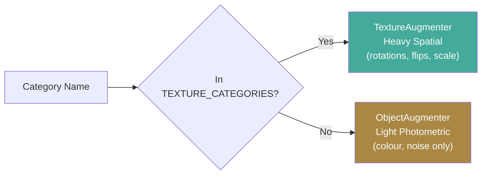
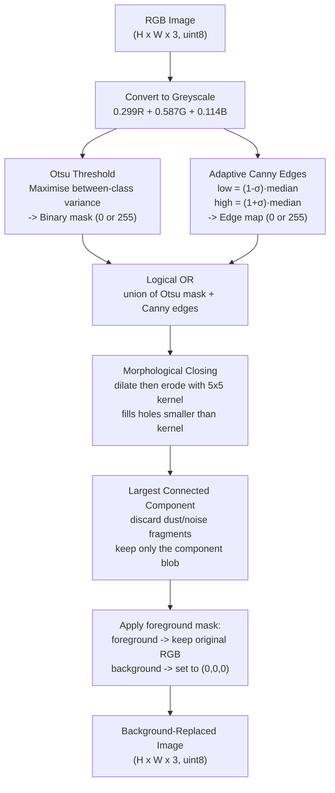

# Keras CAE: Preprocessing - Augmentation, Loading, and BGRP-G

> **Part of the Keras CAE documentation series.** Start at the [Architecture Overview](keras_cae_architecture.md) if you are new to this pipeline.

This page covers **Steps 1 and 2**: how raw MVTec images are augmented, loaded, and prepared before the network ever sees them. These steps are silent but critical - errors here corrupt everything downstream.

---

## Step 1: Category-Aware Augmentation

### The Central Question

Before augmenting training data, you must answer one question:
*"What kinds of variation are genuine normal variation, versus variation that would teach the model to accept defective images as normal?"*

The answer is completely different for texture materials versus shaped objects.

### Texture Categories (wood, carpet, leather, tile, grid)

These materials are **spatially invariant** - a photo of wood grain looks statistically identical whether you rotate it 90° or not. The grain pattern is a statistical texture property, not a directional feature of the object. There is no "correct" orientation for a wood plank.

This means we can apply **heavy spatial augmentation**:

- **Rotations**: ±90°, 180°, 270° (full 360° coverage)
- **Horizontal and vertical flips**: double the diversity at zero cost
- **Scale jitter (zoom)**: 80-100% of original size, randomly cropped back to `img_size`
- **Photometric augmentation**: brightness ±20%, contrast ±20%

Every augmented version is a valid normal training example, providing a much richer distribution of normal appearance from a small set of original images.

### Object Categories (bottle, transistor, pill, screw, etc.)

These are **directionally aligned** - objects always arrive on the inspection conveyor in a consistent physical orientation. An upside-down transistor *is* anomalous. If we rotate it 180° during training, we teach the model "upside-down is normal" - the model will then reconstruct upside-down defective images just as well as correct ones, destroying detection.

**Applied augmentations**: photometric only:

- Brightness ±10%, contrast ±10%, saturation ±10%
- Gaussian noise σ=0.02 (simulates sensor noise without spatial distortion)

No spatial transforms are ever applied to object categories.



**Implementation**: [`augmentation.py`](../../app/pipelines/preprocessing/augmentation.py)

---

## Step 2: Data Ingestion, Image Loading and Foreground Extraction (BGRP-G)

### Part A - The Image Loading Pipeline

Before any segmentation or training, every image passes through a precise loading pipeline implemented in [`cae_pipeline.py: _load_images_as_numpy`](../../app/pipelines/modelling/keras_cae/cae_pipeline.py#L90-L121). The choices made here are invisible but have downstream consequences on everything the network learns. Getting them wrong silently corrupts the entire detector.

#### `pil_img.convert("RGB")` - Why force three channels?

The MVTec dataset contains images saved in multiple formats: RGB JPEG, RGBA PNG (with a transparency channel), 8-bit greyscale PNG, and paletted palette-mapped PNG. A network that expects a 3-channel `(H, W, 3)` input will either crash or silently produce garbage if fed a 1-channel `(H, W)` greyscale image or a 4-channel `(H, W, 4)` RGBA image.

`pil_img.convert("RGB")` normalises any source format into exactly 3 colour channels (Red, Green, Blue), regardless of how the original file was encoded. This is silent but essential - it guarantees consistent array shapes across the entire dataset.

#### `.resize((img_size, img_size), Image.Resampling.LANCZOS)` - Why LANCZOS?

All images must be resized to the same square resolution (`img_size x img_size`, default 128x128) because neural networks require fixed-size inputs. The resampling algorithm chosen for downsampling matters significantly for preserving fine detail:

| Resampling Algorithm | Method | Quality | Preserves fine edges? |
|---|---|---|---|
| **NEAREST** | Copy nearest pixel | Lowest (blocky) | No |
| **BILINEAR** | Weighted average of 4 neighbours | Moderate | Partially |
| **BICUBIC** | Fit cubic polynomial over 16 neighbours | Good | Mostly |
| **LANCZOS (chosen)** | Windowed sinc function over many neighbours | Highest | Yes |

**LANCZOS** (also known as sinc-resampling) computes each output pixel as a weighted combination of many input pixels using a bell-shaped sinc window. This preserves fine-grained edge detail, texture sharpness, and high-frequency structure. These properties are critical for anomaly detection: defects are often fine cracks, hairline scratches, or subtle texture interruptions that are destroyed by lower-quality resizing.

We pay a small speed penalty, but images are only loaded once (not per training step), making this acceptable.

#### `np.array(resized, dtype=np.uint8)` - Converting to numpy

PIL Images use lazy loading and are PIL-specific objects. Converting to a numpy `uint8` array (8-bit unsigned integers, values 0-255) makes them compatible with OpenCV (which requires numpy arrays) and enables efficient batch stacking via `np.stack`.

#### Mask loading: NEAREST interpolation and binarisation at 127

Ground truth defect masks (used for pixel-level AUPIMO evaluation) are loaded separately in `_load_masks_as_numpy` with **deliberately different** resizing:

```python
resized = pil_mask.resize((img_size, img_size), Image.Resampling.NEAREST).convert("L")
mask_array = (np.array(resized, dtype=np.uint8) > 127).astype(np.uint8)
```

**Why NEAREST for masks, not LANCZOS?** Defect masks are binary images - pure white (255) marks the defect, pure black (0) marks the normal region. If LANCZOS (or any smooth interpolation) were applied, anti-aliasing at the boundary would produce intermediate values (e.g., 80 or 150). The subsequent threshold at 127 would then make the exact pixel-level boundary depend on floating-point interpolation arithmetic - introducing label errors precisely at the edges where correct annotation matters most.

NEAREST (nearest-neighbour) copies the closest source pixel value without blending, preserving the hard binary boundary. After resizing, `> 127` binarises the greyscale mask to a clean {0, 1} array: `1 = defect pixel`, `0 = normal pixel`.

---

### Part B - Why Keep RGB? The Case Against Greyscale Reduction

You might ask: if we are zeroing out the background anyway, why not reduce to a single greyscale channel to save computation? Three strong arguments say no.

**Argument 1 - Colour defects exist in MVTec AD.** Several MVTec categories contain defects that are purely chromatic: contamination patches on capsules with an abnormal tint, incorrect colouring on carpet tiles, oxidation discolouration on metal surfaces. Greyscale averaging (`0.299R + 0.587G + 0.114B`) would render these defects invisible - a deeply-red contamination spot on a blue pill might produce the same greyscale value as the surrounding normal surface, making it undetectable.

**Argument 2 - RGB channels carry independent structural signals.** In materials like leather, wood grain, and fabric, the R/G/B channels carry subtly different patterns due to subsurface scattering and directional reflections. Greyscale collapses these three independent information planes into one weighted sum, which can cancel out structural features that are visible only in a single channel.

**Argument 3 - Memory cost is modest.** Going from 1 to 3 channels increases input data size by 3x, but the convolutional layers quickly become independent of this choice: only the first encoder Conv2D layer has 3x the number of input connections; all deeper layers operate entirely on abstract feature maps whose size is independent of the input channel count.

---

### Part C - Foreground Extraction: What BGRP-G Means

**BGRP-G** = **B**ack**G**round **R**e**P**lacement to **G**reyscale/Black.
It refers to the strategy of segmenting the component from the background and replacing the background with a solid, guaranteed out-of-distribution colour - solid black (all channels zero) in our case.

**Implementation**: [`segmentation.py`](../../app/pipelines/preprocessing/segmentation.py)

### Why Industrial Images Need Background Removal

Inspection images always include backgrounds: conveyor belts, mounting jigs, test stages, and holding fixtures. These are completely irrelevant to the question *"is this component defective?"* but they cause two compounding problems:

1. **Wasted model capacity**: The autoencoder must learn to reconstruct both the component surface *and* the background. Every filter trained to reconstruct the conveyor belt texture is a filter unavailable for learning fine-grained surface anomalies.
2. **False positives from background variation**: Subtle background changes - a piece of dust settling in a different position between shifts, a shadow moving as the overhead light warms up, a slight reflection off a passing component - generate reconstruction errors that the model misidentifies as defects.

### Why Solid Black as the Replacement Colour?

Black (pixel values `(0, 0, 0)`) is maximally out-of-distribution for industrial surfaces, which are bright, saturated, and textured. An autoencoder trained exclusively on black-background images rapidly learns to perfectly reconstruct black regions (they are constant, trivially predictable), contributing effectively zero error to the anomaly score. Background pixels become completely invisible to the anomaly detector - which is the goal.

### How Otsu's Thresholding Works

**Otsu's method** (Nobuyuki Otsu, 1979) automatically finds the single greyscale threshold that best separates a two-class pixel distribution (foreground vs. background) without any manual parameter setting.

**How it works**: The algorithm tests every possible threshold $T \in \{0, \ldots, 255\}$ and computes the *between-class variance* of the resulting two groups:

$$\sigma_B^2(T) = w_0(T) \cdot w_1(T) \cdot \left[\mu_0(T) - \mu_1(T)\right]^2$$

Where:

- $w_0(T)$ = fraction of pixels with intensity **below** threshold $T$ (the "background" group)
- $w_1(T)$ = fraction of pixels with intensity **above** threshold $T$ (the "foreground" group)
- $\mu_0(T)$, $\mu_1(T)$ = mean intensities of those two groups

The optimal threshold is $T^* = \arg\max_T \sigma_B^2(T)$ - the value that makes the two groups as different from each other as possible.

**Why this works for MVTec**: Components are generally well-contrasted against their background, creating a bimodal greyscale histogram - two peaks with a valley in between. Otsu reliably finds the valley. **Limitation**: Otsu can fail if the component and background have similar intensities. That is precisely why Canny edges are OR-combined with the Otsu mask as a complementary fallback.

```python
_, otsu_mask = cv2.threshold(grey, 0, 255, cv2.THRESH_BINARY + cv2.THRESH_OTSU)
# The '0' is ignored; THRESH_OTSU overrides it with the computed optimal threshold.
```

### How Canny Edge Detection Works

**Canny edge detection** (John Canny, 1986) finds sharp boundaries of objects by locating locally maximal image gradients. It operates in four internal stages:

1. **Gaussian smoothing**: Convolve with a small Gaussian kernel to suppress pixel-level noise before gradient computation. Without this step, every noise spike would appear as a false edge.
2. **Gradient computation**: Apply Sobel filters in $x$ and $y$ directions to find the gradient magnitude $|\nabla I|$ and direction $\theta$ at every pixel. Pixels where the intensity changes sharply have large magnitude.
3. **Non-maximum suppression (NMS)**: Thin detected edges to exactly 1-pixel width by only keeping pixels that are the *local maximum gradient* in their gradient direction. This prevents the same physical edge from producing multiple adjacent edge pixels.
4. **Hysteresis thresholding**: Apply two thresholds, not one.
    - Pixels above `high_thresh` -> **strong edges** (definitely an edge).
    - Pixels between `low_thresh` and `high_thresh` -> **weak edges** (edge only if connected to a strong edge).
    - Pixels below `low_thresh` -> **discarded** (noise).
    - This ensures complete edge tracing while suppressing isolated noise spikes.

**Adaptive thresholds in our pipeline** (from `segmentation.py`):

```python
median_val = float(np.median(grey))
low_thresh = max(0.0, (1.0 - self.canny_sigma) * median_val)  # canny_sigma=0.33
high_thresh = min(255.0, (1.0 + self.canny_sigma) * median_val)
```

With `canny_sigma = 0.33`, thresholds are ±33% around the median pixel intensity. Bright images automatically get higher thresholds (more selective - only the sharpest edges qualify) and dark images get lower thresholds (more sensitive - fainter edges count). This makes the detector **self-calibrating** across MVTec's varied lighting conditions without any manual tuning.

### The Complete BGRP-G Pipeline



**Morphological closing** = dilate the mask (expand foreground outward by the kernel radius) then erode it back (shrink inward by the same amount). Net effect: any hole in the mask smaller than the 5x5 structuring element is permanently filled. This bridges small gaps between Otsu regions and Canny edges - for example, where a component surface happens to have the same intensity as the background in a small patch.

**Largest connected component**: After combining Otsu and Canny, the mask may contain multiple disconnected blobs (the component, dust particles, image artefacts). We use `cv2.connectedComponentsWithStats` to identify all regions and keep only the largest one - which is almost always the actual component under inspection.

---

### Part D - Optional Preprocessing Enhancements (CLAHE & Gaussian Blur)

In addition to background removal, the pipeline exposes two classical computer vision enhancements that can be toggled depending on the component's surface properties.

#### Contrast Limited Adaptive Histogram Equalization (CLAHE)

**Why?** Standard histogram equalization stretches the contrast globally across the entire image. This often over-amplifies noise in flat regions (like a smooth metal surface) and washes out bright areas. **CLAHE** solves this by operating on small local tiles (default 8x8) and applying a **contrast limit** (clip limit = 2.0). If any histogram bin exceeds this limit, the excess pixels are redistributed.

- **What to expect**: Significantly enhanced visibility of faint surface textures, scratches, or subtle stains that are otherwise hidden in dark or low-contrast regions.
- **Risks**: CLAHE fundamentally alters the statistical distribution of pixel intensities. It can amplify microscopic, normal surface variations into what the network perceives as major structural features. If the component has heavy, naturally occurring surface noise, CLAHE might cause false positives.

#### Gaussian Blur

**Why?** High-frequency sensor noise, dust, or microscopic surface variations can cause a sensitive model to flag normal regions as defective. A Gaussian Blur (default kernel size = 5x5) acts as a low-pass filter, smoothing out these high-frequency details while preserving the macro-structure of the object.

- **What to expect**: A cleaner, smoother image representation. This forces the model (or Patchcore) to focus on structural anomalies rather than pixel-level noise, often reducing the false positive rate on noisy datasets.
- **Risks**: Blurring destroys fine detail. If the anomalies you are trying to detect are microscopic (e.g. hairline cracks, tiny pinholes, fine scratches), applying Gaussian blur will effectively erase the defect from the image before the model ever sees it, drastically increasing false negatives.

#### Combination Risks (The "Enhance and Destroy" Anti-Pattern)

Be incredibly careful when combining **CLAHE** and **Gaussian Blur**.

- Applying CLAHE *amplifies* local high-frequency details and noise to make them visible.
- Applying Gaussian Blur *suppresses* high-frequency details and noise.
If you apply both, they directly fight each other. Depending on the order of operations, you may end up amplifying noise only to blur it into a larger, unnatural smudge, which the model will almost certainly flag as an anomaly. **We recommend using only one or the other, never both.**

---

## What Comes Next

After preprocessing:

- Images are normalised from `uint8` (0-255) to `float32` (0.0-1.0) by dividing by 255.
- The preprocessed images are fed to the CAE encoder.

Continue reading: **[Model Architecture & Training ->](keras_cae_model.md)**

---

## References

- Otsu, N. (1979). *A Threshold Selection Method from Gray-Level Histograms.* IEEE SMC.
- Canny, J. (1986). *A Computational Approach to Edge Detection.* IEEE TPAMI.
