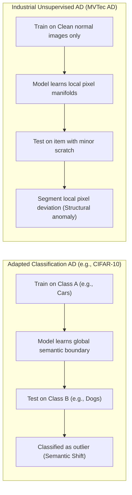
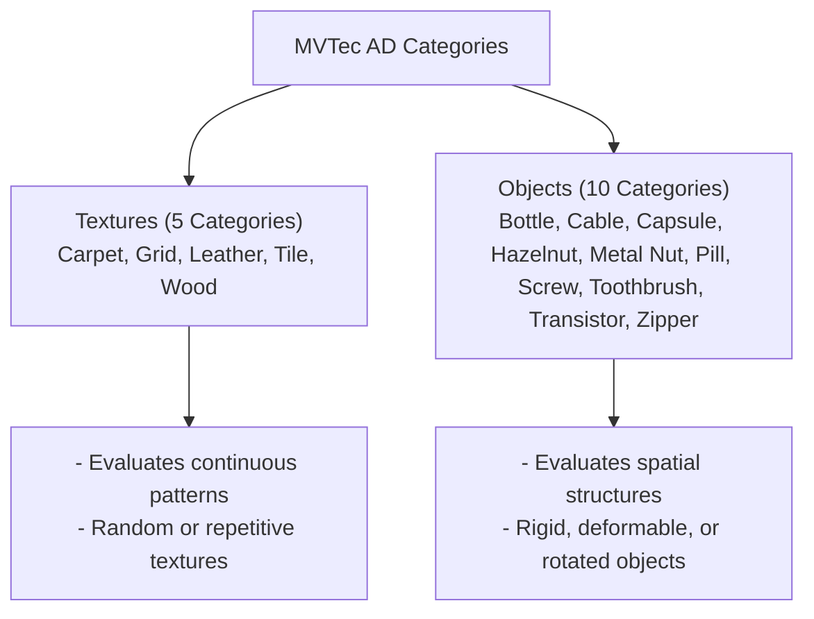
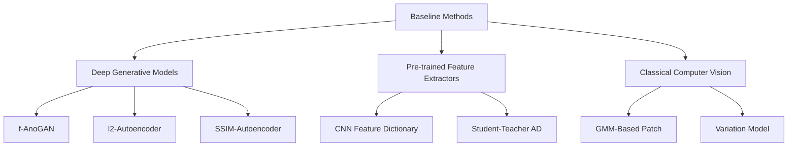

# MVTec AD: A Comprehensive Real-World Dataset for Unsupervised Anomaly Detection

This document provides a detailed overview of the **MVTec AD** dataset, its design philosophy, mathematical metrics, threshold estimation methods, baseline benchmarks, and core experimental insights.

* **Authors:** Paul Bergmann, Kilian Batzner, Michael Fauser, David Sattlegger, Carsten Steger (MVTec Software GmbH)
* **Sources:** CVPR 2019 (*"MVTec AD"*) and IJCV 2021 (Extended Version)

---

## 1. Key Concept & Paradigm Shifts

Prior to the introduction of MVTec AD, anomaly detection (AD) models were primarily evaluated using adapted classification datasets (such as MNIST, CIFAR-10, or ImageNet). In those artificial setups, researchers designated one or more semantic classes as "normal" (e.g., training a model only on images of "cars") and all other classes as "outliers" or "anomalies" (e.g., testing on "dogs" or "airplanes"). 

MVTec AD was introduced to solve the limitations of this paradigm by providing the first comprehensive, high-resolution dataset specifically designed for unsupervised anomaly detection and localization in real-world industrial inspection tasks.

### Novelty Detection vs. Anomaly Detection

The paper establishes a clear boundary between two terms that are frequently conflated:

1. **Novelty Detection (Image-Level):**
    * **Goal:** Determine whether an entire query image belongs to a different semantic distribution relative to the training set.
    * **Characteristics:** The shift is global and semantic (e.g., distinguishing a dog from an airplane). Historically, algorithms were tested by training on 9 classes of CIFAR-10 and treating the 10th as an outlier.
2. **Anomaly Detection (Pixel-Level / Anomaly Localization):**
    * **Goal:** Find, isolate, and segment subtle, highly localized physical deviations (e.g., scratches, dents, contaminations, structural faults) on an object that is otherwise structurally identical and normal.
    * **Characteristics:** The data manifold of the normal class is extremely confined. The deviations occupy only a tiny fraction of the total pixel space.

### The Real-World Unsupervised Constraint

In manufacturing, supervised learning is impractical because:

1. **High Yields:** Modern manufacturing lines are optimized to produce virtually zero defects, making anomalous training data extremely scarce.
2. **Unbounded Defect Modes:** Future defects can take infinite shapes, sizes, colors, and textures, which cannot be modeled in a closed-world training set.

Consequently, models must learn a representation of "normal" purely from anomaly-free images, and flags any deviation from this normal distribution during inference.

---

## 2. The MVTec AD Dataset Details

MVTec AD provides a rigorous benchmark capturing real-world industrial complexities:

* **Scale and Resolution:** 5,354 high-resolution color images. These were acquired using $2048 \times 2048$ industrial RGB sensors equipped with bilateral telecentric lenses to minimize perspective distortion. The raw captures were cropped to resolutions between $700 \times 700$ and $1024 \times 1024$ pixels.
* **Defect Complexity:** 73 distinct physical anomaly types (e.g., scratches, contaminations, misplaced parts, structural deformations, cut wires).
* **Ground Truth:** 1,888 pixel-precise annotated anomalous regions in the test set.

The dataset is divided into two major subsets across 15 categories:

---

## 3. Comprehensive Evaluation Metrics

Evaluating anomaly segmentation requires specific metrics because anomalies represent a tiny fraction of the dataset (only **2.7%** of all test set pixels are anomalous).

### Notation

Let:

* $\mathcal{T}$: The test set consisting of $n$ images $\{I_1, I_2, \dots, I_n\}$.
* $p$: A pixel index within an image.
* $A_i(p) \in \mathbb{R}$: The continuous anomaly score predicted for image $I_i$ at pixel $p$.
* $G_i(p) \in \{0, 1\}$: The binary ground-truth label at pixel $p$ (where $1$ is anomalous, $0$ is normal).
* $t \in \mathbb{R}$: A binarization threshold.
* $P_i(t) = \{p \mid A_i(p) \ge t\}$: The set of pixels predicted as anomalous in image $I_i$ at threshold $t$.

---

### 3.1 Pixel-Level Metrics

Treating each pixel independently allows us to compute the standard entries of the confusion matrix:

* **True Positive (TP):** $p$ where $G_i(p) = 1$ and $A_i(p) \ge t$.
* **False Positive (FP):** $p$ where $G_i(p) = 0$ and $A_i(p) \ge t$.
* **True Negative (TN):** $p$ where $G_i(p) = 0$ and $A_i(p) < t$.
* **False Negative (FN):** $p$ where $G_i(p) = 1$ and $A_i(p) < t$.

From these, we define:

* **True Positive Rate (TPR / Recall):**

    $$TPR(t) = \frac{TP}{TP + FN} = \frac{\sum_i |P_i(t) \cap \{p \mid G_i(p) = 1\}|}{\sum_i |\{p \mid G_i(p) = 1\}|}$$

* **False Positive Rate (FPR):**

    $$FPR(t) = \frac{FP}{FP + TN} = \frac{\sum_i |P_i(t) \cap \{p \mid G_i(p) = 0\}|}{\sum_i |\{p \mid G_i(p) = 0\}|}$$

* **Precision (PRC):**

    $$PRC(t) = \frac{TP}{TP + FP} = \frac{\sum_i |P_i(t) \cap \{p \mid G_i(p) = 1\}|}{\sum_i |P_i(t)|}$$

* **Intersection over Union (IoU):**

    $$IoU(t) = \frac{TP}{TP + FP + FN} = \frac{\sum_i |P_i(t) \cap \{p \mid G_i(p) = 1\}|}{\sum_i |P_i(t) \cup \{p \mid G_i(p) = 1\}|}$$

#### The Flaw of Pixel-Level Metrics

Pixel-level metrics introduce a massive **size bias**. If a test set contains one image with a huge defect (e.g., $10,000$ pixels) and ten images with tiny defects (e.g., $10$ pixels each), a model that perfectly segments the large defect but misses all the small ones will still achieve a very high pixel-level TPR (Recall). In industrial settings, missing a tiny functional defect is just as critical as missing a large aesthetic one.

---

### 3.2 Region-Level Metric: Per-Region Overlap (PRO)

To prevent large anomalies from dominating the evaluation, the Per-Region Overlap (PRO) metric weights every connected anomalous component equally, regardless of its size.

Let:

* $C_{i,k}$ be the set of pixels belonging to the $k$-th connected ground truth component (individual defect region) in image $I_i$.
* $\mathcal{K}_i$ be the set of all connected components in image $I_i$.
* $N = \sum_i |\mathcal{K}_i|$ be the total number of connected anomalous components across the entire test set.

At a given binarization threshold $t$, the Per-Region Overlap (PRO) is defined as:

$$PRO(t) = \frac{1}{N} \sum_i \sum_{k \in \mathcal{K}_i} \frac{|P_i(t) \cap C_{i,k}|}{|C_{i,k}|}$$

* **Equal Weighting:** For each component $C_{i,k}$, the overlap ratio $|P_i(t) \cap C_{i,k}| / |C_{i,k}|$ is bounded in $[0, 1]$. A component of size $5$ pixels contributes exactly as much to the final PRO as a component of size $5,000$ pixels.

---

### 3.3 Threshold-Independent Integration (AUC)

To avoid choosing an arbitrary threshold $t$ during benchmarking, performance is evaluated as the Area Under the Curve (AUC) across all possible thresholds:

* **AU-ROC (Area Under the Receiver Operating Characteristic):**
    Plots $FPR(t)$ on the x-axis against $TPR(t)$ on the y-axis.
* **AU-PR (Area Under the Precision-Recall Curve):**
    Plots $TPR(t)$ (Recall) on the x-axis against $PRC(t)$ (Precision) on the y-axis. It is highly sensitive to class imbalance, making it a strict measure of false-positive containment.
* **AU-PRO (Area Under the Per-Region Overlap Curve - Crucial Contribution):**
    Plots the Set $FPR(t)$ on the x-axis against $PRO(t)$ on the y-axis.

    * **Logistical Integration Bound:** In a real factory, triggering a false positive rate above $30\%$ is unacceptable (it would mean rejecting nearly a third of all normal products). Therefore, the AU-PRO is integrated only up to a strict False Positive Rate threshold (typically $FPR \le 0.3$) and normalized back to $[0, 1]$:

        $$AU\text{-}PRO = \frac{1}{0.3} \int_0^{0.3} PRO(FPR^{-1}(f)) \, df$$

        where $FPR^{-1}(f)$ maps the target FPR value $f$ to the corresponding binarization threshold $t$.

---

## 4. Threshold Estimation Techniques

To make a binary pass/fail decision on a production line, the continuous anomaly map $A(p)$ must be binarized using a threshold $t$. Because no anomalous samples are present during training, $t$ must be estimated purely from an anomaly-free validation set $V$.

The authors evaluated four thresholding techniques:

### 1. Maximum Threshold

$$t = \max_{I \in V, p} A_I(p)$$

* **Methodology:** Selects the maximum anomaly score observed across all pixels in the validation set.
* **Properties:** Highly conservative. It guarantees zero false positives on the validation set. However, it is highly sensitive to noise or outliers, which can inflate the threshold and cause the model to miss actual defects during testing.

### 2. p-Quantile Threshold

$$t = Q_p(\{A_I(p) \mid I \in V, \text{ all } p\})$$

* **Methodology:** Sets the threshold $t$ such that exactly a fraction $p$ (e.g., $99\%$) of all validation pixels fall below it.
* **Properties:** Robust against single-pixel noise outliers, but requires pre-selecting an arbitrary quantile parameter $p$.

### 3. k-Sigma Threshold

$$t = \mu + k\sigma$$

* **Methodology:** Assumes that the validation pixel anomaly scores follow a Gaussian distribution $\mathcal{N}(\mu, \sigma^2)$, where:

    $$\mu = \frac{1}{|V| \cdot M} \sum_{I \in V} \sum_p A_I(p)$$

    $$\sigma = \sqrt{\frac{1}{|V| \cdot M} \sum_{I \in V} \sum_p (A_I(p) - \mu)^2}$$

    The threshold is placed $k$ standard deviations above the mean.

* **Properties:** Simple statistical baseline, but the Gaussian assumption frequently fails in practice due to the complex, multi-modal distributions of anomaly scores.

### 4. Max-Area Threshold

* **Methodology:** Sets $t$ by incorporating spatial context. It raises the threshold until no connected component of false positives (where $A_I(p) \ge t$) on the validation set exceeds a predefined maximum permissible pixel area (e.g., $0.1\%$ of the total image area).
* **Properties:** Prevents tiny, isolated noise pixels from triggering false alarms, but allows small, localized false positive areas up to the specified limit.

> [!IMPORTANT]
> **Key Finding:** Threshold estimation is highly volatile. No single technique generalizes across all models and categories. Assumptions like normal distribution of anomaly scores frequently fail, and an estimator that works perfectly for one model/dataset combination may fail on another.

---

## 5. Benchmarking Baseline Methods

The extended paper benchmarks 7 distinct approaches, grouped into three primary paradigms:

### 5.1 Deep Generative Models

Generative models learn the low-dimensional manifold of normal images. During inference, anomalies are detected by comparing the input image against its reconstruction.

#### 1. f-AnoGAN (Fast AnoGAN)

* **Architecture:** Consists of a Generative Adversarial Network (GAN) and an encoder. The generator $G$ and discriminator $D$ are trained on normal images. Then, an encoder $E$ is trained to map an input patch $x$ to a latent representation $z$, attempting to minimize a reconstruction loss and a discriminator feature matching loss.

* **Anomaly Map:** Computed as the pixel-wise $l_2$ distance between the input patch $x$ and its reconstruction $G(E(x))$:

    $$A(p) = \|x(p) - G(E(x))(p)\|_2$$

#### 2. $l_2$-Autoencoder

* **Architecture:** A Convolutional Autoencoder (CAE) trained with a pixel-wise Mean Squared Error ($l_2$) loss to compress and reconstruct normal images.

* **Anomaly Map:**

    $$A(p) = (I(p) - \hat{I}(p))^2$$

    where $\hat{I}$ is the reconstructed image.

#### 3. SSIM-Autoencoder

* **Architecture:** A CAE trained using a Structural Similarity Index (SSIM) loss rather than $l_2$ distance. SSIM compares local patterns of pixel intensities, luminance, and contrast over a local window (typically $11 \times 11$).

* **Anomaly Map:** Computed using the local SSIM distance:

    $$A(p) = 1 - \text{SSIM}(I, \hat{I})(p)$$

* **Significance:** This forces the network to respect structural features and patterns, making it highly effective for texture categories.

---

### 5.2 Pre-trained Feature Extractors (Transfer Learning)

These methods use networks pre-trained on ImageNet to extract rich, discriminative local descriptors, bypassing the need to train generative networks.

#### 4. CNN Feature Dictionary

* **Methodology:**
    1. Extract local feature patches from the average pooling layer of a pre-trained ResNet-18.
    2. Apply Principal Component Analysis (PCA) to reduce the feature dimensions.
    3. Use K-Means clustering to partition the normal features into a dictionary of $K$ cluster centers $\{c_1, \dots, c_K\}$.
* **Anomaly Map:** The anomaly score for a patch feature $f(p)$ is the Euclidean distance to the nearest cluster center:

    $$A(p) = \min_{j \in \{1, \dots, K\}} \|f(p) - c_j\|_2$$

#### 5. Student-Teacher Anomaly Detection

* **Methodology:**
    1. A pre-trained ImageNet network acts as a **Teacher** $T$.
    2. An ensemble of $M$ randomly initialized **Student** networks $\{S_1, \dots, S_M\}$ is trained to regress the dense feature maps of the Teacher using only normal data.

* **Anomaly Map:** Anomalous inputs yield high regression errors and high predictive variance among the students because the student ensemble has never seen these patterns:

    $$A(p) = \frac{1}{M} \sum_{j=1}^M \|T(I)(p) - S_j(I)(p)\|^2_2$$

---

### 5.3 Classical Computer Vision

#### 6. GMM-Based Texture Inspection

* **Methodology:**
    1. Extract hand-crafted texture features (such as Gabor filters or pixel intensities) from small $7 \times 7$ patches across multiple scales of an image pyramid.
    2. Fit a Gaussian Mixture Model (GMM) with $K$ components to these patches using normal training images.

* **Anomaly Map:** The anomaly score is the negative log-likelihood of the test patch features under the GMM:

    $$A(p) = -\ln \left( \sum_{k=1}^K \pi_k \mathcal{N}(f(p); \mu_k, \Sigma_k) \right)$$

#### 7. Variation Model

* **Methodology:**
    1. Requires strict, shape-based alignment of all images using normalized cross-correlation.
    2. Computes a pixel-wise mean image $\mu(p)$ and standard deviation map $\sigma(p)$ across all aligned training images.
* **Anomaly Map:** The anomaly score is the normalized deviation of the test pixel from the mean:

    $$A(p) = \frac{|I(p) - \mu(p)|}{\sigma(p) + \epsilon}$$

where $\epsilon$ is a small constant to prevent division by zero.

---

## 6. Key Experimental Findings

1. **Transfer Learning Dominates:** The Student-Teacher framework and the CNN Feature Dictionary outperformed deep generative models across almost all metrics (AU-ROC, AU-PRO, AU-PR). Features pre-trained on ImageNet are highly robust and sensitive to localized deviations that generative models miss.
2. **Generative Models Struggle (Blurriness & Mode Collapse):**
    * **f-AnoGAN** suffered from mode collapse on complex object classes, failing to capture the full variety of normal patterns.
    * Both **CAE architectures ($l_2$ and SSIM)** produced blurry reconstructions. They failed to recreate high-frequency details (such as fine wood grains or toothbrush bristles), resulting in high reconstruction errors on normal regions, which triggered false positive blobs.
3. **Classical Models Remain Competitive:** On rigid, perfectly aligned objects, the classical **Variation Model** frequently outperformed deep generative models. However, it fails completely on unaligned or deformable objects (like Cable). Similarly, **GMMs** performed exceptionally well on pure textures but struggled on structured objects.
4. **The AUC Limit Effect:** When models were evaluated using the AU-PRO metric integrated up to a relaxed limit ($FPR \le 0.3$), many models appeared to perform acceptably. However, when the integration limit was strictly restricted to $FPR \le 0.01$ ($AU\text{-}PRO_{0.01}$), performance plummeted. This indicates that many models can only detect anomalies if they are allowed to simultaneously trigger a high number of false alarms.
5. **Execution Time & Memory Trade-offs:**

| Method | Inference Speed | Accuracy (Localization) | Key Bottleneck |
| :--- | :--- | :--- | :--- |
| **Feature Dictionary** | Very Slow (Seconds) | High | Extracting features from $100,000+$ sliding windows. |
| **Autoencoders** | Extremely Fast (Milliseconds) | Low | Blurry reconstructions, high false positive rate. |
| **Student-Teacher** | Balanced (100-300ms) | Very High | Ensemble size (requires forward passes through all student networks). |
