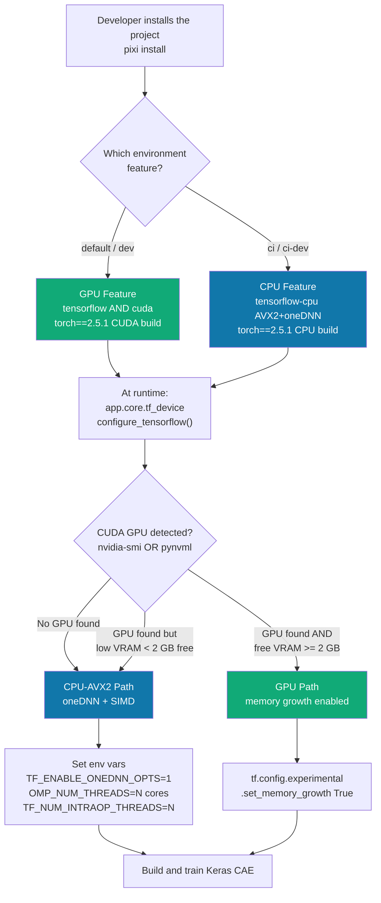
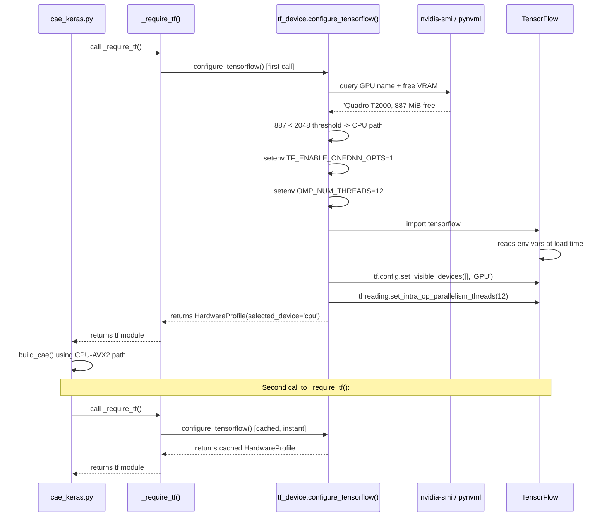
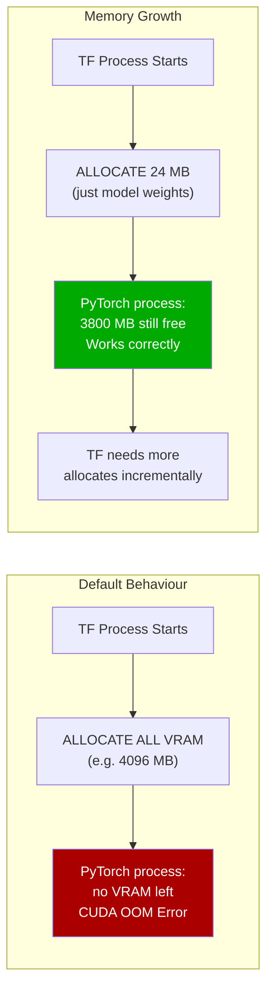
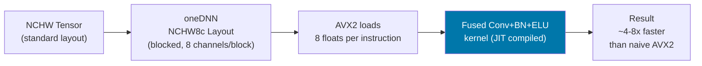
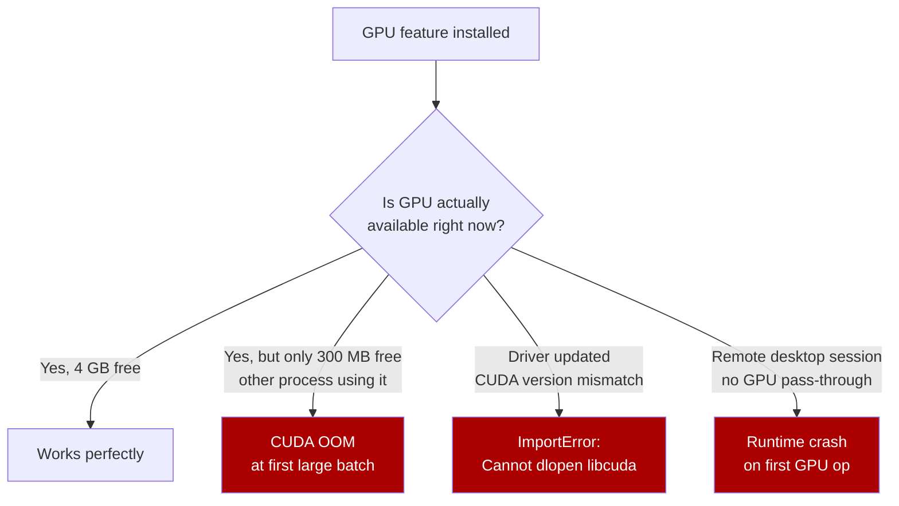
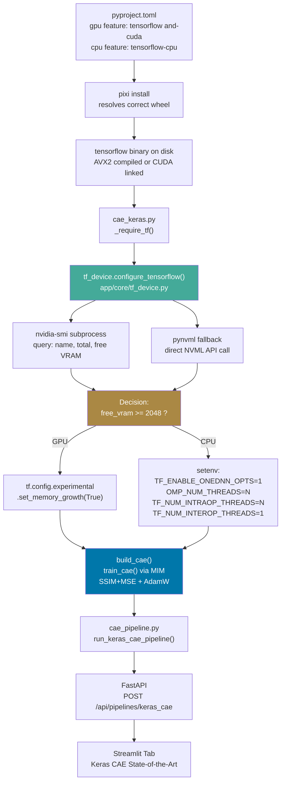

> **Audience**: Anyone who wants to understand how and why the system automatically chooses between CUDA GPU acceleration and AVX2 SIMD CPU execution - and why that decision is made in two separate stages rather than one.

---

## The Problem: One Codebase, Wildly Different Machines

Industrial anomaly detection is deployed in diverse environments:

- A **development laptop** with an integrated Intel GPU (no CUDA).
- A **data scientist's workstation** with an NVIDIA GPU but already loaded with
  a PyTorch PatchCore model consuming most VRAM.
- A **production server** with multiple GPUs shared across teams via SLURM.
- A **CI/CD pipeline** (GitHub Actions) running on a plain Linux runner with no GPU.

A naive solution - "just use the GPU if it's there" - fails in most of these cases.
The system needs a smarter, two-stage strategy.

---

## The Two-Tier Strategy



### Tier 1 - Install Time (Pixi Feature Split)

This tier determines **which binary build** of TensorFlow lands on disk.

### Tier 2 - Runtime (Dynamic Device Detection)

This tier determines **how to configure** whichever TF binary is installed.

The key insight: these are orthogonal concerns. You could have the GPU build installed
but be forced to use CPU because the GPU is busy. You could have the CPU build installed
and still benefit from proper thread configuration. The two tiers handle each independently.

---

## Tier 1 - Pixi Feature Split in Detail

### How Pixi Features Work

Pixi uses a **feature system** analogous to Cargo's feature flags in Rust. Each
feature defines a set of additional dependencies. Features are activated per-environment:

```toml
[tool.pixi.environments]
default  = { features = ["gpu"],        solve-group = "default" }
dev      = { features = ["dev", "gpu"], solve-group = "default" }
ci       = { features = ["cpu"],        solve-group = "ci"      }
ci-dev   = { features = ["dev", "cpu"], solve-group = "ci"      }
```

The `solve-group` ensures that GPU and CPU environments are solved independently -
their dependency trees are allowed to diverge (different CUDA-linked wheels vs pure
CPU wheels).

### The GPU Feature: `tensorflow[and-cuda]`

```toml
[tool.pixi.feature.gpu.pypi-dependencies]
tensorflow = { version = ">=2.16,<3", extras = ["and-cuda"] }
```

The `[and-cuda]` extra - introduced in TensorFlow 2.12 - is a bundled wheel strategy.
Before TF 2.12, GPU support required separately installing:

- CUDA Toolkit (system-level, version-locked)
- cuDNN (system-level, manually matched to CUDA version)
- cuBLAS (system-level)
- NCCL (for multi-GPU, system-level)

This was infamously fragile: TF 2.x required CUDA 11.x, but your OS might ship CUDA 12.
A minor version mismatch caused a silent `ImportError` with an unhelpful message.

`[and-cuda]` bundles the CUDA runtime, cuDNN, and cuBLAS directly inside the wheel.
You install one package and GPU support works - no system-level CUDA required.

**Requirement**: NVIDIA driver >= 520 (for CUDA 12.x runtime, which TF 2.16+ uses).

### The CPU Feature: `tensorflow-cpu`

```toml
[tool.pixi.feature.cpu.pypi-dependencies]
tensorflow-cpu = ">=2.16,<3"
```

`tensorflow-cpu` is a separate PyPI package (not just the same binary with GPU disabled).
It is compiled with different compiler flags that activate AVX2 and enable the
Intel oneDNN (MKL-DNN) backend, which provides hand-tuned kernels for:

- Convolution layers (the most compute-intensive part of a CAE)
- Dense (matrix multiplication) layers
- Batch normalisation
- Element-wise operations

The result is a binary that processes 8 float32 values per CPU clock cycle via AVX2,
vs the theoretical 1 value/cycle of a scalar fallback build.

---

## Tier 2 - Runtime Detection in Detail

### Source: `app/core/tf_device.py`



### Detection Method 1: `nvidia-smi`

```bash
nvidia-smi --query-gpu=gpu_name,memory.total,memory.free --format=csv,noheader,nounits
```

`nvidia-smi` is the NVIDIA System Management Interface CLI tool, installed
alongside the NVIDIA GPU driver. It communicates directly with the kernel-mode
driver via the NVML C library.

**Advantages**:

- Works with any CUDA-capable driver without Python dependencies.
- Returns accurate real-time VRAM figures including memory held by other processes.
- Reliable across all NVIDIA architectures from Kepler (2012) to Hopper (2022+).

**Disadvantages**:

- Subprocess overhead (~50ms startup time for the Java-free path).
- Not available on AMD or Intel GPUs.
- May be absent in minimal container images.

### Detection Method 2: `pynvml`

```python
import pynvml

pynvml.nvmlInit()
handle = pynvml.nvmlDeviceGetHandleByIndex(0)
mem_info = pynvml.nvmlDeviceGetMemoryInfo(handle)
free_mib = mem_info.free // (1024 * 1024)
```

`pynvml` are Python bindings to the same NVML library that `nvidia-smi` uses.
The call goes directly into the shared library without spawning a subprocess.

**Advantages**:

- No subprocess overhead (microseconds, not milliseconds).
- Structured Python API - no CSV parsing.
- Already installed as `pynvml >=11.5.0,<12` in the base Pixi dependencies.

**Disadvantages**:

- Requires `pynvml` package (already included, not an extra dependency here).
- Same hardware limitation as nvidia-smi (NVIDIA only).

### The VRAM Threshold

```python
DEFAULT_MIN_VRAM_MIB: int = 2048  # 2 GB free required to use GPU
```

Why 2 GB, not some other value?

| Model Component | Approximate VRAM Usage (img_size=128) |
|---|---|
| CAE weights (float32, ~6M params) | ~24 MB |
| Activation maps during forward pass | ~180 MB |
| Batch of 16 images (128x128x3 float32) | ~3 MB |
| TF framework overhead | ~300 MB |
| PyTorch PatchCore (already loaded) | ~800-1200 MB |
| **Total (both models)** | **~1.3-1.7 GB** |

The 2 GB threshold gives a comfortable 300+ MB safety margin above realistic usage.
It also ensures the GPU stays responsive - an allocation that nearly fills VRAM
will cause CUDA out-of-memory errors on batch size spikes.

**Users can override the threshold:**

```python
from app.core.tf_device import configure_tensorflow

profile = configure_tensorflow(min_vram_mib=4096)  # Require 4 GB free for GPU
```

---

## GPU Path: Memory Growth

When GPU is selected, `set_memory_growth(True)` is applied to every visible GPU device:

```python
for gpu in tf.config.list_physical_devices("GPU"):
    tf.config.experimental.set_memory_growth(gpu, True)
```

### Why Memory Growth?

By default, TensorFlow allocates **all available VRAM at process startup** - even if
the model only needs 200 MB of the 4 GB available. This is called *eager allocation*.



**Why does TF default to eager allocation?**
It was designed for batch training workloads where a single TF process owns the GPU
for hours. In our case, PyTorch (PatchCore baseline) and TF (Keras CAE) coexist in the
same Python process - memory growth is essential.

**Does memory growth hurt performance?**
Slightly - incremental allocations cause occasional small pauses. For training workloads
(seconds per batch), this is negligible. For 10ms real-time inference, it could matter,
but is avoidable by pre-warming the model with a dummy batch.

---

## CPU Path: AVX2 SIMD + Intel oneDNN

This is where the most engineering detail lives.

### What is SIMD?

SIMD stands for **Single Instruction, Multiple Data**. A normal (scalar) CPU instruction
operates on one value at a time. A SIMD instruction operates on an entire vector of
values in the same number of clock cycles.

```text
Scalar (no SIMD):
  Cycle 1: a[0] * b[0]
  Cycle 2: a[1] * b[1]
  Cycle 3: a[2] * b[2]
  ...
  Cycle N: a[N-1] * b[N-1]

AVX2 (256-bit SIMD):
  Cycle 1: a[0..7] * b[0..7]  (8 float32 multiplied simultaneously)
  Cycle 2: a[8..15] * b[8..15]
  ...
  Cycle N/8: a[(N-8)..(N-1)] * b[(N-8)..(N-1)]
```

For convolution in a CAE, the inner loop multiplies millions of filter-weight/input-pixel
pairs per forward pass. With AVX2, 8 of these multiplications happen per cycle instead of 1,
giving up to **8x theoretical throughput improvement**.

### AVX2 Register Layout

```text
256-bit AVX2 YMM register:
┌────────────┬────────────┬────────────┬────────────┬────────────┬────────────┬────────────┬────────────┐
│  float32   │  float32   │  float32   │  float32   │  float32   │  float32   │  float32   │  float32   │
│  [0]       │  [1]       │  [2]       │  [3]       │  [4]       │  [5]       │  [6]       │  [7]       │
│  32 bits   │  32 bits   │  32 bits   │  32 bits   │  32 bits   │  32 bits   │  32 bits   │  32 bits   │
└────────────┴────────────┴────────────┴────────────┴────────────┴────────────┴────────────┴────────────┘
                                    256 bits total = 8 x float32

128-bit SSE4 XMM register (older, half the width):
┌────────────┬────────────┬────────────┬────────────┐
│  float32   │  float32   │  float32   │  float32   │
│  [0]       │  [1]       │  [2]       │  [3]       │
└────────────┴────────────┴────────────┴────────────┘
                  128 bits total = 4 x float32

Scalar (no SIMD):
┌────────────┐
│  float32   │
└────────────┘
     32 bits = 1 x float32
```

All Intel processors from Haswell (2013) and AMD processors from Zen (2017) support AVX2.
The detection in `tf_device.py` reads `/proc/cpuinfo` to confirm:

```python
def _check_avx2_support() -> bool:
    with open("/proc/cpuinfo") as f:
        return "avx2" in f.read()
```

### Intel oneDNN (formerly MKL-DNN)

Even with AVX2 instructions available, a naive implementation won't reach peak
throughput - convolutions have complex memory access patterns that must be carefully
arranged to avoid CPU cache misses.

Intel oneDNN (open-source Deep Neural Network Library) provides:

- **Blocked memory layouts**: Rearranges tensor data in cache-friendly 8-wide strips
  aligned for AVX2 loads.
- **Fused kernels**: Fuses Conv2D + BatchNorm + ELU into a single kernel pass,
  eliminating intermediate writes to RAM.
- **JIT compilation**: Generates machine code specialised for your exact convolution
  shape at the first call, then reuses it - no branching overhead.



### Thread Configuration

```python
os.environ["TF_ENABLE_ONEDNN_OPTS"] = "1"  # Activate oneDNN/AVX2 kernels
os.environ["OMP_NUM_THREADS"] = cores  # OpenMP parallel threads (oneDNN uses this)
os.environ["TF_NUM_INTRAOP_THREADS"] = cores  # TF threads within one op (e.g. one Conv2D)
os.environ["TF_NUM_INTEROP_THREADS"] = "1"  # TF threads between ops (keep serial)
os.environ["TF_CPP_MIN_LOG_LEVEL"] = "2"  # Suppress oneDNN startup banner
```

**Why `INTEROP_THREADS=1`?**
Inter-op parallelism runs *different* TF operations in parallel (e.g., the encoder and
decoder forward passes of two different images simultaneously). In a pipeline that
processes images sequentially, this only causes cache thrash between threads competing
for the same data. Setting it to 1 keeps the execution serial but maximises intra-op
parallelism (all cores focus on one conv layer at a time).

**Why set env vars *before* importing TF?**
oneDNN reads `OMP_NUM_THREADS` and `TF_ENABLE_ONEDNN_OPTS` at the moment the shared
library (`libtensorflow.so`) is loaded into the process. If TF is already imported when
you set the env var, the setting is silently ignored. The module uses `os.environ.setdefault`
(not `os.environ[key] = value`) to avoid overriding environment variables that the
user has already set intentionally.

---

## The Singleton Cache Pattern

```python
def configure_tensorflow(min_vram_mib: int = DEFAULT_MIN_VRAM_MIB) -> HardwareProfile:
    # Fast path: return cached result if already configured
    if configure_tensorflow._cached_profile is not None:
        return configure_tensorflow._cached_profile
    # ... perform detection and configuration ...
    configure_tensorflow._cached_profile = profile
    return profile


configure_tensorflow._cached_profile = None  # module-level cache slot
```

### Why Store the Cache on the Function Object?

Python functions are first-class objects - you can attach arbitrary attributes to them.
This pattern (sometimes called a "function-level singleton") avoids the need for:

- A module-level `_GLOBAL_PROFILE` variable (less obvious ownership).
- A class with a class-level variable (boilerplate for a one-shot operation).
- `functools.lru_cache` (requires hashable arguments; `min_vram_mib` must remain mutable).

The cache persists for the lifetime of the Python process and is reset only on process restart.

### Why Cache at All?

`nvidia-smi` takes 30-80ms to start a subprocess. Calling `configure_tensorflow()` 100
times during training (e.g., inside a loop that calls `_require_tf()`) would waste
3-8 seconds just on GPU detection. The cache reduces all subsequent calls to
a dictionary lookup (< 1 microsecond).

---

## Classical Alternatives Considered

### Alternative 1: Install-time Only - No Runtime Detection

**What it would look like:**
Simply install the appropriate TF feature and trust the user to pick correctly.
If `gpu` feature is installed, TF uses the GPU. If `cpu` feature, it uses CPU.

**Why we rejected it:**



The GPU feature being installed is a necessary but not sufficient condition for GPU
*execution* to be safe. Runtime validation is essential for a resilient system.

---

### Alternative 2: `CUDA_VISIBLE_DEVICES` Environment Variable

**What it would look like:**
Document that users must set `CUDA_VISIBLE_DEVICES=""` to force CPU mode.

**Why we rejected it:**

- Requires manual user action - easy to forget.
- Does not handle the partial-VRAM scenario (GPU visible but too little free memory).
- `CUDA_VISIBLE_DEVICES` only hides GPUs from CUDA; it does not configure oneDNN
  threading on the CPU path.
- In Jupyter notebooks, users rarely think about environment variables before starting
  the kernel.

---

### Alternative 3: `tf.test.is_gpu_available()` (deprecated)

```python
# Deprecated TF API - do not use
if tf.test.is_gpu_available():
    use_gpu()
```

**Why we rejected it:**

- Deprecated in TF 2.x, removed in TF 2.10+. Triggers a deprecation warning.
- Only returns a boolean - does not report VRAM availability.
- Triggers GPU initialisation as a side effect, preventing memory growth from being set
  (memory growth must be configured *before* TF initialises any GPU device).
- Does not configure the CPU path if GPU is rejected.

---

### Alternative 4: Separate Containers (Docker)

**What it would look like:**
`Dockerfile.gpu` and `Dockerfile.cpu` with TF baked in at build time. Container choice
determines device. No runtime detection needed.

**Why we rejected it:**

- Adds Docker as a hard dependency - not all development machines run Docker.
- Two Dockerfiles to maintain in sync.
- Pixi already solves the dependency isolation problem without containers.
- Containers complicate Jupyter notebook workflows (mounting volumes, GPU pass-through flags).
- No benefit over the Pixi feature approach, with significantly more complexity.

---

### Alternative 5: ONNX Runtime with OrtValue Device Dispatch

**What it would look like:**
Export trained Keras model to ONNX, use ONNX Runtime's `CUDAExecutionProvider` /
`CPUExecutionProvider` with automatic fallback.

```python
import onnxruntime as ort

providers = ["CUDAExecutionProvider", "CPUExecutionProvider"]
session = ort.InferenceSession("model.onnx", providers=providers)
```

**Why we did not choose this as the primary approach:**

| Aspect | TF/Keras (our choice) | ONNX Runtime |
|---|---|---|
| Training | Native, full ecosystem | Export only (no training API) |
| Custom loss (SSIM+MSE) | Native `tf.image.ssim` | Post-training only |
| Masked Image Modeling | Custom training loop | N/A (inference only) |
| Device selection | Our `tf_device.py` | Automatic provider fallback |
| AVX2 optimisation | oneDNN via env vars | Built-in ORT OpenMP |
| Debugging | TF eager mode, `breakpoint()` | Black-box session |

ONNX Runtime is an excellent **inference** runtime and would be appropriate for
production deployment of a pre-trained model. For the **training + evaluation** use
case of this research pipeline, it is not applicable.

---

### Alternative 6: JAX with `jax.devices()`

**What it would look like:**
JAX provides a clean device model (`jax.devices("gpu")`, `jax.devices("cpu")`)
and automatically compiles to XLA for both GPU and CPU.

```python
import jax

devices = jax.devices("gpu") or jax.devices("cpu")
```

**Why we did not choose JAX:**

- The team uses TF/Keras for the CAE (as specified in requirements).
- JAX requires different model definition syntax (functional, no `model.fit()`).
- JAX does not have a direct equivalent to `tf.image.ssim` (requires custom SSIM).
- JAX's XLA compilation for the first batch takes 30-90 seconds - painful for interactive use.
- JAX is still evolving rapidly; the ecosystem is less stable than TF 2.x for production.

---

### Alternative 7: Pure PyTorch (Existing Framework)

**What it would look like:**
Implement the CAE in PyTorch alongside the existing `ConvAutoencoder` baseline,
using the same `torch.device("cuda" if torch.cuda.is_available() else "cpu")` pattern.

**Why TF/Keras was chosen (as specified in requirements):**

- `tf.image.ssim` is natively built into TF - no custom implementation needed.
- The `AdamW` optimizer is built into `tf.keras.optimizers` since Keras 2.x.
- `tf.keras.layers.ELU()` is a first-class layer with BatchNorm integration.
- The goal was specifically to explore the TF ecosystem alongside the PyTorch baseline,
  providing a direct comparison of the two frameworks on the same dataset.
- Having both frameworks demonstrates framework-agnostic anomaly detection architecture.

---

## Environment Variables Applied by `tf_device.py`

The following table documents every environment variable set by the CPU path,
with the reasoning for each specific value:

| Variable | Value | Purpose | Why This Value |
|---|---|---|---|
| `TF_ENABLE_ONEDNN_OPTS` | `"1"` | Activate Intel oneDNN AVX2/AVX-512 kernels | Must be `"1"` to enable; off by default in some TF builds |
| `OMP_NUM_THREADS` | `str(cpu_count)` | OpenMP thread count for oneDNN parallel loops | Match physical core count for maximum SIMD lane utilisation |
| `TF_NUM_INTRAOP_THREADS` | `str(cpu_count)` | Threads within one TF op (e.g., one Conv2D) | Match core count; each core handles one AVX2-width tile of the output |
| `TF_NUM_INTEROP_THREADS` | `"1"` | Threads between different TF ops | Serial op scheduling avoids cache eviction between competing ops |
| `TF_CPP_MIN_LOG_LEVEL` | `"2"` | Suppress C++ layer INFO messages | oneDNN prints verbose JIT kernel info at level 0/1; level 2 = WARNING+ only |

**Variable precedence rule**: All variables use `os.environ.setdefault(key, value)`.
This means user-set environment variables are never overridden. A researcher who
needs maximum AVX-512 width can set `TF_ENABLE_ONEDNN_OPTS=2` in their shell and the
module will respect it.

---

## Integration Map



---

## Live Example Output

On the development machine (NVIDIA Quadro T2000, 4 GB total, 887 MiB free due to
existing processes), the module correctly selects the CPU-AVX2 path even though
CUDA hardware is present:

```text
============================================================
TensorFlow Device Configuration
============================================================
  CUDA available  : True
  GPU             : Quadro T2000
  VRAM free/total : 887 / 4096 MiB
  CPU cores       : 12
  AVX2 (256-bit)  : True
  Selected device : CPU
  Reason          : GPU 'Quadro T2000' has only 887 MiB free
                    (< threshold 2048 MiB). Using AVX2 CPU path.
  Applied settings:
    • TF_ENABLE_ONEDNN_OPTS=1
    • OMP_NUM_THREADS=12
    • TF_NUM_INTRAOP_THREADS=12
    • TF_NUM_INTEROP_THREADS=1
    • TF_CPP_MIN_LOG_LEVEL=2
============================================================
```

This demonstrates the value of runtime detection: the GPU feature is installed,
the GPU hardware is present, CUDA is functional - but the intelligent VRAM check
prevents a training run that would have crashed with `CUDA_ERROR_OUT_OF_MEMORY`
partway through the first epoch.

---

## Summary: Decision Matrix

| Scenario | CUDA Available | Free VRAM | `tensorflow` build | Selected Device |
|---|---|---|---|---|
| CI / GitHub Actions | No | 0 | `tensorflow-cpu` (cpu feature) | CPU-AVX2 |
| Dev laptop (Intel GPU) | No | 0 | `tensorflow` (gpu feature) | CPU-AVX2 |
| Dev workstation, GPU loaded | Yes | 400 MiB | `tensorflow[and-cuda]` (gpu feature) | CPU-AVX2 |
| Dev workstation, GPU free | Yes | 3200 MiB | `tensorflow[and-cuda]` (gpu feature) | GPU |
| Production server, shared GPU | Yes | 2400 MiB | `tensorflow[and-cuda]` (gpu feature) | GPU |
| Production server, GPU occupied | Yes | 1500 MiB | `tensorflow[and-cuda]` (gpu feature) | CPU-AVX2 |

---

## Related Documentation

- [Keras CAE Architecture](keras_cae_architecture.md) - Full CAE model design including
  ELU, Masked Image Modeling, SSIM+MSE loss, Top-K pooling, and AUPIMO evaluation.
- [Pixi Package Management](../concepts/pixi.md) - How Pixi features and environments work.
- Source: [`app/core/tf_device.py`](../../app/core/tf_device.py)
- Source: [`pyproject.toml`](../../pyproject.toml)
