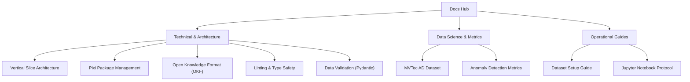

# Industrial Anomaly Detection Documentation Hub

Welcome to the central engineering, architecture, and data science documentation hub. This workspace houses both the technical framework layouts and the theoretical data science tracks for our specialized industrial intelligence pipelines.

---

## 📈 Project Track Overview

This repository hosts the production development track for **Anomaly Detection in Industrial Components** (Difficulty Level: 10/10; Cursus: Data Science). The project leverages deep learning, advanced computer vision, and structured validation methods to isolate and segment defects in manufacturing components.

---

## 📂 Documentation Structure & Modules

The documentation is organized into clear operational tracks:

### 1. [Technical & Architecture Concepts](concepts/index.md)
Detailed conceptual guides on software engineering foundations, environment containment, and quality gates:
*   [Vertical Slice Architecture (VSA)](concepts/vertical_slice_architecture.md) — Structuring features into self-contained vertical slices.
*   [Pixi Package Management](concepts/pixi.md) — Multi-platform dependency synchronization and multi-language toolchains.
*   [Open Knowledge Format (OKF)](concepts/open_knowledge_format.md) — Node-based markdown specification guidelines for AI-human pair programming.
*   [Linting & Type Safety](concepts/linting_and_types.md) — Enforcement of strict coding standards using Ruff and Mypy.
*   [Data Validation (Pydantic)](concepts/data_validation.md) — Runtime data validation and configuration schemas.

### 2. [Data Science & Metrics](data_science/index.md)
The scientific core covering datasets, evaluation methodologies, and metrics:
*   [MVTec AD Dataset](data_science/mvtec_ad.md) — Structure, complexity, threshold estimation, baselines, and experimental insights for the primary industrial dataset.
*   [Anomaly Detection Metrics](data_science/anomaly_detection_metrics.md) — Deep mathematical walkthrough of AUROC, AUPRO, and the novel AUPIMO metric under low-false-positive constraints.

### 3. Operational Guides & Planning
Practical walkthroughs for setting up workspaces and tracking progress:
*   [Jupyter Notebook Workspace Protocol](guides/notebooks.md) — Guidelines for running safe, automated, quality-gated notebooks.
*   [Dataset Setup Guide](guides/dataset_setup.md) — Standardized dataset acquisition and path structures.
*   [Project Roadmap & Detailed Plan](project_roadmap.md) — Development milestones, deliverables track, and synchronization schedules.

---

## 📂 Deliverables Log

*   **Deliverable 1 (Due 24/07):** Data Exploration, Visualization & Pre-processing Report *(Pending)*
*   **Deliverable 2 (Due 04/09):** Machine Learning & Deep Modeling Optimization Report *(Pending)*
*   **Final Synthesis (Due 15/09):** Integrated Final Performance & Vision Blueprint *(Pending)*

---

## 📊 Dataset & Citation

This project utilizes the **MVTec AD (Anomaly Detection)** dataset. Please cite the original papers if referenced in scientific work:

> Paul Bergmann, Kilian Batzner, Michael Fauser, David Sattlegger, Carsten Steger: *The MVTec Anomaly Detection Dataset: A Comprehensive Real-World Dataset for Unsupervised Anomaly Detection*. International Journal of Computer Vision 129(4):1038-1059, 2021.
>
> Paul Bergmann, Michael Fauser, David Sattlegger, Carsten Steger: *MVTec AD — A Comprehensive Real-World Dataset for Unsupervised Anomaly Detection*. IEEE/CVF Conference on Computer Vision and Pattern Recognition (CVPR), 9584-9592, 2019.
