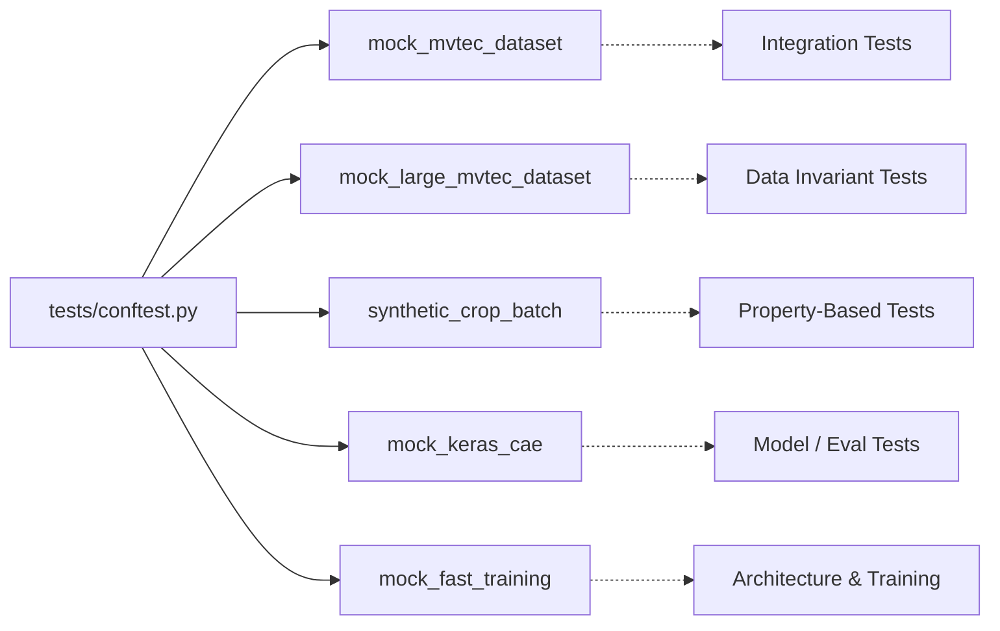
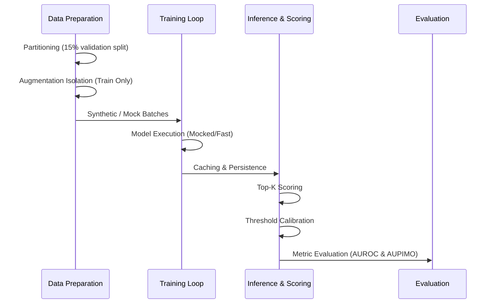
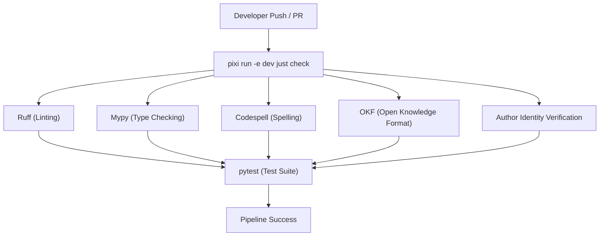

# Test Architecture & Setup

## Executive Overview & Testing Philosophy

Our testing architecture is built around a rigorous, multi-layered test pyramid designed to ensure the reliability and correctness of the core Deep Learning and API pipelines. This includes:
- **Unit Tests:** Verify individual components, functions, and models in isolation.
- **Property-Based Tests (Hypothesis):** Validate mathematical invariants and transformation boundaries across vast generative parameter spaces.
- **Invariant & Leakage Tests:** Ensure strict data boundaries (e.g., preventing data leakage between train/validation splits) and verify augmentation isolation.
- **API Integration Tests:** Confirm the end-to-end correctness of the application contracts.

### Isolation Principle
We adhere to strict isolation principles to ensure reliability and speed during CI/dev runs:
- **Zero GPU Dependency:** CI/dev test runs require no GPU, utilizing CPU-based computation and mocked components.
- **Fast Execution:** The suite is optimized for speed, executing 50+ tests in under 60 seconds.
- **Synthetic Tensor Generators:** We employ synthetic tensor and dataset generation over large static assets to keep the repository lightweight and tests deterministic.

---

## Architectural Diagrams

### Diagram 1: Test Taxonomy & Directory Layout

```mermaid
flowchart TD
    Tests["tests/"]
    Unit["unit/"]
    Integration["integration/"]

    Tests --> Unit
    Tests --> Integration

    Integration --> API["test_api_cae_pipeline.py"]

    Unit --> Hyp["test_cae_hypothesis.py"]
    Unit --> DataInv["test_cae_data_invariants.py"]

    Unit --> CAE_Arch["test_cae_architecture_and_training.py"]
    Unit --> CAE_Aug["test_cae_augmentation_and_segmentation.py"]
    Unit --> CAE_Crop["test_cae_crops_and_stitching.py"]
    Unit --> CAE_Eval["test_cae_evaluation_and_explainability.py"]
    Unit --> CAE_Pers["test_cae_persistence.py"]

    Unit --> CoreData["test_domain_data.py"]
    Unit --> CorePre["test_preprocessing.py"]
    Unit --> CoreAE["test_autoencoder.py"]
    Unit --> CoreCLI["test_cli.py"]
    Unit --> CoreConfig["test_config.py"]
```


### Diagram 2: Fixture Dependency & Data Flow Graph


### Diagram 3: CAE Pipeline Verification & Invariant Lifecycle


### Diagram 4: CI/CD Quality Gate Pipeline


---

## Detailed Test Suite Specifications

### Integration Tests
- **`tests/integration/test_api_cae_pipeline.py`**
  Validates the FastAPI `/api/pipelines/keras_cae` execution contract. It tests chained preprocessing pipelines, deterministic model cache-hit & evaluation parity, and properly formats and responds to 500 server errors.

### Property-Based Testing (Hypothesis)
- **`tests/unit/test_cae_hypothesis.py`**
  Focuses on mathematical invariant verification with Hypothesis strategies. Key cases include:
  - Patch crop/stitch roundtrip identity.
  - Top-K pooling monotonicity and non-negativity bounds.
  - SSIM+MSE loss identity and symmetry.
  - Adaptive threshold stability under extreme distributions.
  - Otsu+Canny binary mask invariants.

### Data Invariants & Leakage Prevention
- **`tests/unit/test_cae_data_invariants.py`**
  Ensures partitioning isolation (15% split strictly from normal samples without overlap) and augmentation isolation (augmentations are applied strictly to training batches and never to validation/test sets).

### Keras CAE Pipeline Unit Tests
- **`tests/unit/test_cae_architecture_and_training.py`**
  Checks model spatial invariants (e.g., 32x32, 64x64), SSIM+MSE loss noise monotonicity, Masked Image Modeling (MIM) masking ratios, and training loop history correctness.
- **`tests/unit/test_cae_augmentation_and_segmentation.py`**
  Validates category routing (`ObjectAugmenter` vs `TextureAugmenter`), batch augmentation uint8/shape invariants, Otsu+Canny morphology, and connected component extraction.
- **`tests/unit/test_cae_crops_and_stitching.py`**
  Tests grid dimension arithmetic and lossless blending reconstruction mathematically.
- **`tests/unit/test_cae_evaluation_and_explainability.py`**
  Asserts correctness of AUROC, AUPIMO pixel-level localization, error heatmap synthesis, and GT contour overlays.
- **`tests/unit/test_cae_persistence.py`**
  Verifies Keras model save/load numerical consistency, preprocessing step cache hashing, and cached pipeline re-evaluation parity.

### Core, Domain & Preprocessing Suites
- **`tests/unit/test_domain_data.py`**
  Verifies MVTec directory manifest construction and PyTorch Dataset loading contracts.
- **`tests/unit/test_preprocessing.py`**
  Tests step chaining (`CLAHEStep`, `GaussianBlurStep`), the factory builder, and torchvision adapters.
- **`tests/unit/test_autoencoder.py`**
  Evaluates the PyTorch ConvAutoencoder baseline architecture, training, and evaluation hooks.
- **`tests/unit/test_cli.py`**
  Validates CLI argument preprocessing, `key=value` argument conversion, and `--preprocessing-config` JSON parsing.
- **`tests/unit/test_config.py`**
  Tests core settings and environment configurations.

---

## Shared Fixtures Reference (`tests/conftest.py`)

| Fixture Name | Scope | Type | Typical Usage |
|--------------|-------|------|---------------|
| `mock_mvtec_dataset` | Function | `str` (Path) | Creates a minimal mock MVTec AD directory with train, test, and GT data. Ideal for general pipeline and API testing. |
| `mock_large_mvtec_dataset` | Function | `str` (Path) | Creates a larger dataset to rigorously test train/validation split data invariants. |
| `synthetic_crop_batch` | Function | `Callable` | Factory function returning random float32 batches. Used for hypothesis and matrix mathematical invariant tests. |
| `mock_keras_cae` | Function | `tf.keras.Model` | Provides a pre-compiled, lightweight Keras CAE for rapid inference without full initialization overhead. |
| `mock_fast_training` | Function | `Generator` | Mocks the Keras `train_cae` function, replacing execution with a mock history to skip slow epochs in CI. |

---

## Execution & Developer Guide

Use our `pixi` and `just` commands to run testing tasks in a controlled and reliable environment:

**Running the Full Test Suite**
```bash
pixi run -e dev pytest
```

**Running Specific Suites**
```bash
pixi run -e dev pytest tests/unit/test_cae_hypothesis.py
```

**Running with Coverage Reports**
```bash
pixi run -e dev pytest --cov=app --cov-report=term-missing
```

**Running Full Quality Gates**
Before committing, ensure your code meets all guidelines by running:
```bash
pixi run -e dev just check
```
